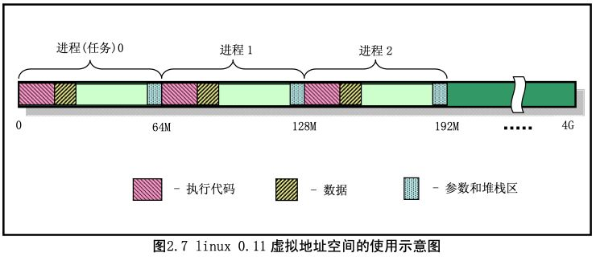
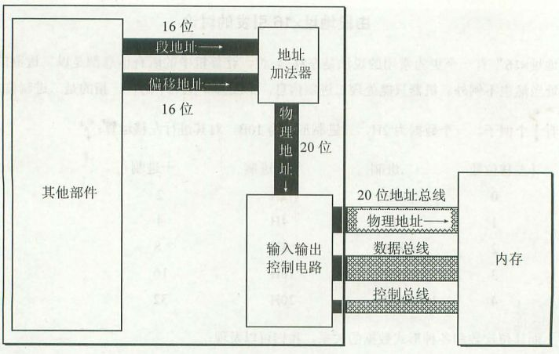

## 分段机制
- 解决了地址空间保护问题
    - **因为进程看到的都是的段，是虚拟地址空间**
    - 思路是，**增加了虚拟内存**
- 缺陷，还是内存使用率低下
    - 对虚拟内存到物理**内存的映射依然是以进程为单位**

- 8086cpu, 20位地址总线
- 物理地址=段地址*16+偏移地址

# 清理段
- **由操作系统和硬件配合完成**
- **段描述符A位（type中的）由 cpu 置1，由操作系统清0，表示被访问过**
- 操作系统发现A位为1，立即清0
- 在一个周期内，操作系统统计A位置1的频率，频率低的，表示使用的少，清出该段

# 段不存在异常
1. cpu读到某个不在内存中的段，报段不存在异常
2. 执行中断程序，中断程序由操作系统提供
3. 中断程序把段从硬盘导入内存
