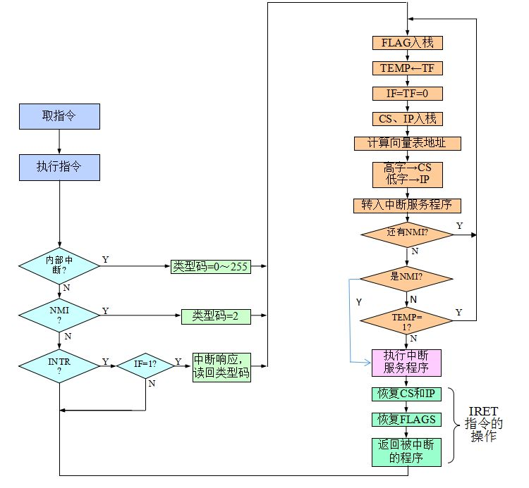
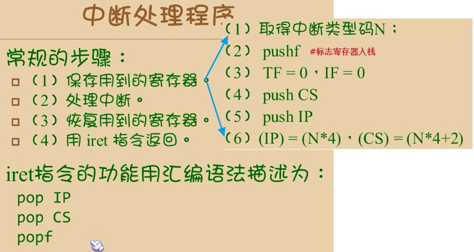
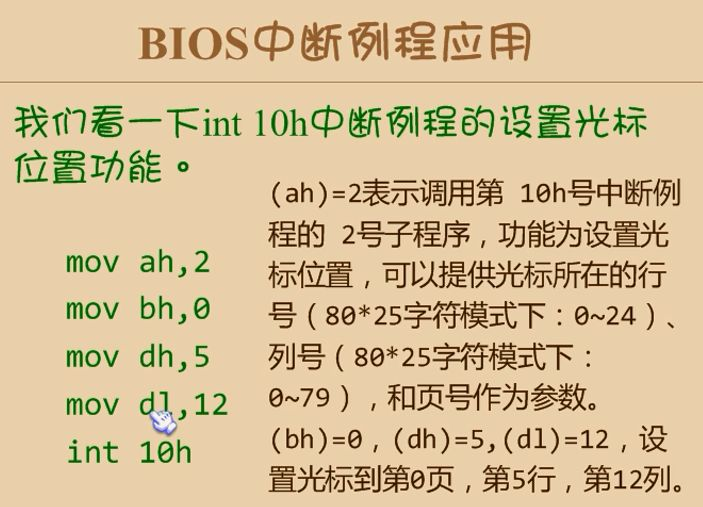
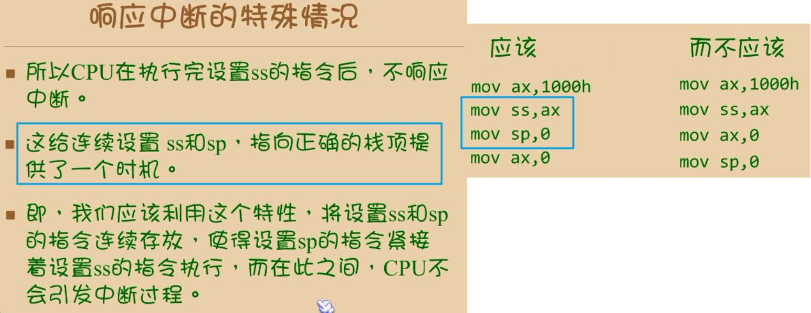
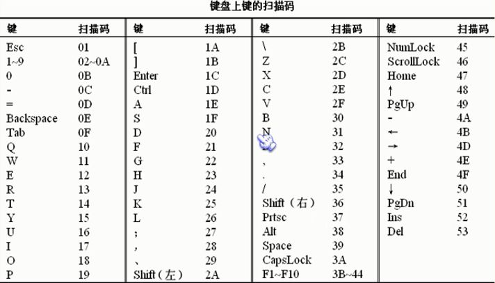

- cpu处理**突发事件**的重要技术

# 中断源
- **异常（Exception）**，**cup内部产生的中断**
	- **是CPU主动产生的**
	- 除法溢出：类型号0，商大于目的操作数所能表达的范围时产生。
	- 单步中断：类型号1，TF=1时产生（当前指令需执行完）
	- 断点中断：类型号3，这是一个软件中断，即INT 3指令。
	- 溢出中断：类型号4，这是一个软件中断，即INTO指令。
- **中断（Interrupt）**，**cup外部发生的中断**，是**真正的中断**，比如各种外设
	- **CPU是被动的**
	- **NMI**，Non Maskable Interrupt，**不可屏蔽中断请求**。**类型号2**
	- **INTR**，**可屏蔽中断请求**，**受IF标志控制**。IF=1时CPU才能响应。
- **软件中断**：即INT n指令，类型号n(0-255)。
	- **本质是异常**

# 可屏蔽中断与不可屏蔽中断
- 不可屏蔽中断, NMI（Non Maskable Interrupt）
	- 中断发生时，无论如何 CPU 都要去处理
	- **不受 IF 位的影响**
	- 断电就是一种不可屏蔽中断
	- 在windows中安装在IDT表的**2号位置**
- 可屏蔽中断，INTR（Interrupt Require）
	- **中断控制器**
	- cpu是**否响应可屏蔽中断**，**受IF标志控制**
	- IF=1，处理可屏蔽中断
		- sti //设置IF=1
		- cli //设置IF=0

**中断控制器(可屏蔽中断控制芯片)**
- 可屏蔽中断是由**一块专门的芯片**来管理的，通常称为中断控制器
- 它负责**分配中断资源**和**管理各个中断源发出的中断请求**
- 通常用**IRQ(Interrupt Request)** 后面加上数字来表示不同的中断
- **时钟中断的IRQ编号为0**，也就是**IRQ0**

# 中断优先级
1. 除法错、溢出、指令、软件中断
2. 不可屏蔽中断
3. 可屏蔽中断
4. 单步调试

# 中断过程
- 中断请求
- 中断判优(有时还要进行中断源识别)
    - 对同时产生的中断：应首先处理优先级别较高的中断；若优先级别相同，则按先来先服务的原则处理；
    - 对非同时产生的中断：低优先级别的中断处理程序允许被高优先级别的中断源所中断——即允许中断嵌套。
- 中断响应
- 中断服务
- 中断返回

## 中断向量表8086
- 8086，中断向量表，0000:0000--0000:03ff，共1024个
- 所以安全地址空间：0:200--0:3ff

## 响应中断的特殊情况

# 键盘扫描码
- 通码，按下时的扫描码，第7位为0
- 断码，松开时的扫描码，第7位为1
- 断码 = 通码 + 80H

# 保护模式中断
[4.4 中断](4.4%20中断.md)

#中断