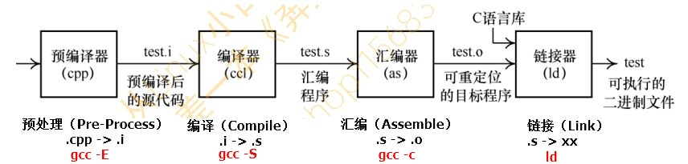

- GNU Compiler Collection
-  **1987年发布了第一个C语言版本**
-  支持多种不同的硬件平台，如x86、 ARM等体系结构。
- 查看 gcc 的版本：gcc –v

# 编译过程分为 4 个阶段
- 预处理, Preprocessing
- 编译, Compilation
- 汇编, Assembly
- 链接, Linking

# 扩展名

- .c    需要预处理的 C 语言源代码
- .h    C 语言源代码头文件
- .i    不需要预处理的 C 语言源代码
- .s    汇编语言代码
- .o    目标文件
- .a    静态对象库
- .so   共享对象库