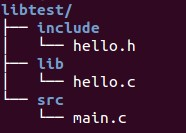

- 动态链接库（通常以.so结尾）
- 静态链接库（通常以.a结尾）
- 默认情况下，链接时优先使用动态链接库(动态链接库不存在时才考虑使用静态链接库)
	- -static选项，强制使用静态链接库



# 静态库
## 编译静态库(.c -> .o)
```
gcc -c –static -I../include hello.c	#-static可选
- 生成目标文件hello.o
- -I添加头文件搜索目录
```

## ar生成静态库(.o -> .a)
```
ar -r libhello.a hello.o
- 将hello.o添加到静态库文件libhello.

ar命令就是用来创建、修改库的
‐d   从归档文件删除指定目标文件列表。
‐q   将指定目标文件快速附加到归档文件末尾。
‐r   将指定目标文件插入文档，如果存在则更新。
‐t   显示目标文件列表
‐x   把归档文件展开为目标文件
```

## 使用静态库
```
 gcc main.c -I../include –L ../lib -lhello -o main
 -L添加库文件搜索目录
 -l指定链接的库文件名称
```

# 动态库
## 编译动态库(.c -> .so)
```
gcc hello.c -I../include -fPIC -shared -o libhello.so
       
# 一条命令生成动态库
gcc -fPIC -shared xxx1.c xxx2.c xxx3.c -o libxxx.so # 多个源文件生成动态库
gcc -fPIC -shared xxx1.o xxx2.o xxx3.o -o libxxx.so # 多个目标文件生成动态库

# 两条命令生成动态库
gcc -c -fPIC add.c -o add.o  # -fPIC 一次只能编译一个
gcc -c -fPIC sub.c -o sub.o
gcc -shared add.o sub.o -o libmymath.so
```
## 使用动态库
```
 gcc main.c -I../include -L../lib -lhello -o main
```