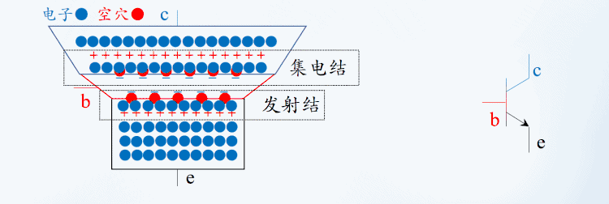
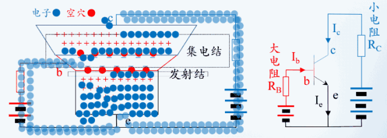

# 三极管（电流控制器件）
发射极，高浓度；容易产生大量电子（用两个正极或者负极的连接来保证）
基极，低浓度，窄；
集电极，平常浓度，宽；

发射极电流IE = 基极电流IB + 集电极电流IC
集电极电流IC  = 基极电流IB x 放大倍数

# 状态
用做开关：截止状态（关），饱和状态（开）
用做放大器：放大状态

## 截止状态

## 饱和状态

## 放大状态

## 击穿状态
