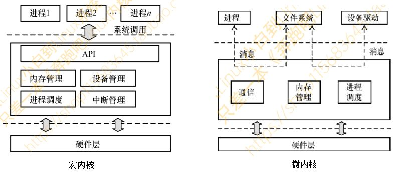
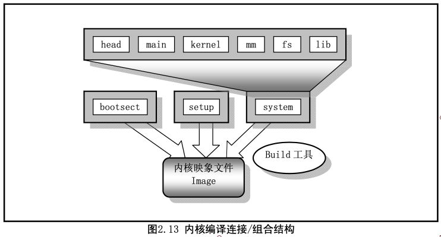
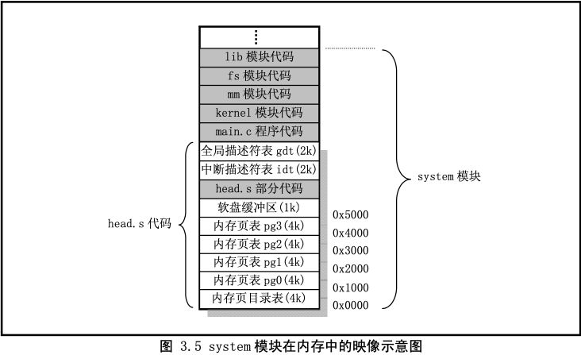

# 内核模式
1. 单内核模式/宏内核
2. 层次式的微内核模式
3. 进程调度模块、内存管理模块、文件系统模块、进程间通信模块和网络接口模块

# 内核分类
	- 微内核 - Windows/Minix、FFlyanx
	- 宏内核 - Unix/Linux

# Linux内核
Linux 0.11 内核，则是采用了**单内核模式/宏内核**
- Linux在当时是业余作品
- Linus本人更喜欢宏内核的设计
- **宏内核架构的优点是设计简洁和性能比较好**
- **微内核架构最大的问题就是高度模块化带来的交互的冗余和效率的损耗** 
  
**Linux内核融合了宏内核和微内核的优点**。
- 模块化设计
- 抢占式内核
- 动态加载内核模块 
  
Linux内核的开发模式完全由社区来主导。
- Linus是Linux内核的最大的维护者和导演
- 每个子模块都有各自维护者 
  
Linux内核架构概貌 
- 应用主程序使用指令(int x80)，使CPU从用户态(User Mode)切换到核心态(Kernel Model)
- 操作系统根据参数值调用特定的系统调用服务程序
- 服务程序则根据需要再底层的一些支持函数以完成特定的功能
- 完成了应用程序所要求的服务后，操作系统又从核心态切换回用户态，返回到应用程序中继续执行后面的指令

# linux0.11内核

