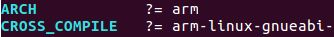

# ABI
- ABI(application binary interface)：二进制应用程序接口
- EABI，嵌入式ABI

# 交叉编译工具
## 安装ARM交叉编译工具
	sudo apt-get install gcc-arm-linux-gnueabi

## 查看版本
	arm-linux-gnueabi-gcc -v 

## 使用 update-alternatives 命令来对 GCC 工具的多个版本进行管理
```
update-alternatives --install <link> <name> <path> <priority>
- link：指向/etc/alternatives/<name>的符号引用
- name： 链接的名称
- path： 这个命令对应的可执行文件的实际路径
- priority： 优先级， 在 auto 模式下， 数字大的优先级比较高

$ sudo update-alternatives --install /usr/bin/arm-linux-gnueabi-gcc arm-linux-gnueabi-gcc /usr/bin/arm-linux-gnueabi-gcc-5 5
$ sudo update-alternatives --install /usr/bin/arm-linux-gnueabi-gcc arm-linux-gnueabi-gcc /usr/bin/arm-linux-gnueabi-gcc-7 7
$ sudo update-alternatives --config arm-linux-gnueabi-gcc  #设置使用的版本
```

# 编译内核和设备树
## 下载内核
https://www.kernel.org/
$ tar xvf linux-4.4.232.tar.xz
$ cd linux-4.4.232/

## 配置Makefile。编辑Makefile文件 或者 直接导出

	$ export ARCH=arm
	$ export CROSS_COMPILE=arm-linux-gnueabi-

## 选择vexpress系列开发板
	$ make vexpress_defconfig  # ./arch/arm/configs/vexpress_defconfig
	$ make menuconfig             # 编译后生成.config文件

## 编译内核，生成zImage镜像文件
	#zImage生成路径：arch/arm/boot/zImage
	$ make zImage -j6（多线程编译，6个线程）

## 编译内核模块
	$ make modules -j4  # drivers/video/backlight/*.ko

## 编译设备树，获得dtb文件
	$ make dtbs  # arch/arm/boot/dts/vexpress-v2p-ca9.dtb


	


