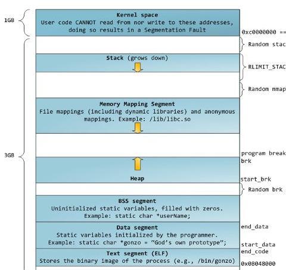
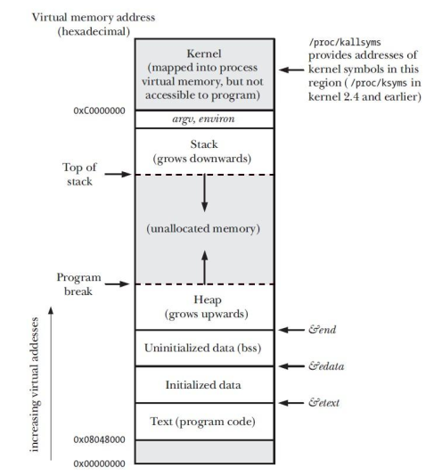
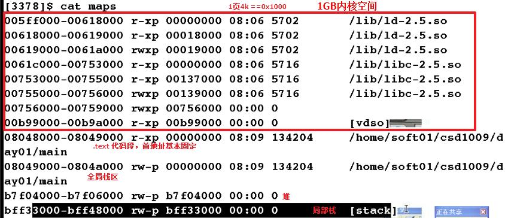
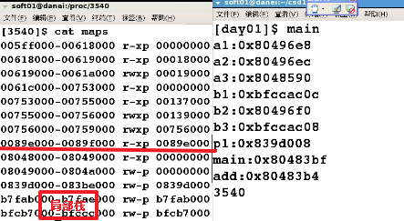
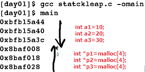

- linux
	- elf(Executable and Linking Format)格式
	- readelf -h 察看执行程序头
- win
	- PE(Portable Executable)格式，是微软Win32环境可移植可执行文件
	- exe、dll、vxd、sys和vdm等的标准文件格式


# 可执行文件结构
- 每一个section包含两个地址，分别是VMA以及LMA
- VMA
	- virtual memory address
	- 加载到ram里面运行的ram地址
- LMA
	- load memory address
	- 是flash地址


# 程序段分析


```c
#include <stdio.h>
#include <stdlib.h>
#include <unistd.h>
int add(int a,int b)
{
	return a+b;
}
int a1=1;
static int a2=2;
const int a3=3;

main()
{
	int b1=4;
	static b2=5;
	const b3=6;
	
	int *p1=malloc(4);
	
	printf("a1:%p\n",&a1);
	printf("a2:%p\n",&a2);
	printf("a3:%p\n",&a3);
	printf("b1:%p\n",&b1);
	printf("b2:%p\n",&b2);
	printf("b3:%p\n",&b3);
	printf("p1:%p\n",p1);
	printf("main:%p\n",main);
	printf("add:%p\n",add);
	
	printf("%d\n",getpid());
	while(1);
}

//a1,a2,b2全局区
//a3,main,add代码区
//b1局部栈
//p1堆区

```

# 堆栈分析

```c
#include <stdio.h>
#include <stdlib.h>
#include <unistd.h>

main()
{
	int a1=10;
	int a2=20;
	int a3=30;
	
	int *p1=malloc(4);
	int *p2=malloc(4);
	int *p3=malloc(4);
	
	printf("%p\n",&a1);
	printf("%p\n",&a2);
	printf("%p\n",&a3);
	printf("%p\n",p1);
	printf("%p\n",p2);
	printf("%p\n",p3);
	
	
	
	printf("%d\n",getpid());
	while(1);
}

```
