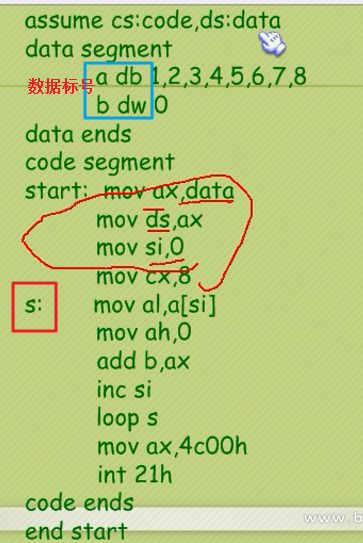
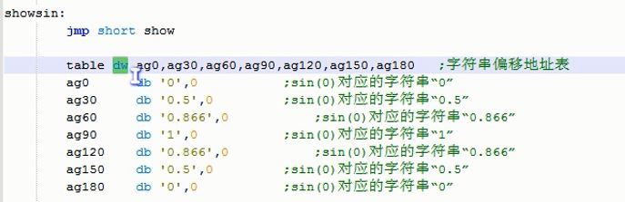

# 汇编语言组成
1. 汇编指令
2. 伪指令。没有对应的机器码，编译器执行，计算机不执行
3. 其他符号。没有对应的机器码，编译器识别

# 框架
```
data SEGMENT '数据段，编程者可以把数据都放到这个段里
....数据部分....  '数据格式是： 标识符 db/dw 数据。
data ENDS  '数据段结束处。

edata SEGMENT '附加数据段，编程者可以把数据都放到这个段里
....附加数据部分....
edata ENDS  '附加数据段结束处。

code SEGMENT  '代码段，实际的程序都是放这个段里。
    ASSUME CS:code,DS:data,ES:edata '告诉编译程序，data段是数据段DS，code段是代码段CS

start:MOV AX,data '前面的start表示一个标识位，后面用到该位，如果用不到，就可以不加
    MOV DS,AX '这一句与上一行共同组成把data赋值给DS。段寄存器.
    MOV AX,edata 
    MOV ES,AX '与前一句共同组成edata->ES
    ....程序部分....
    MOV AX,4C00h  '程序退出，该句内存由下一行决定。退出时，要求ah必须是4c。
    INT 21h
code ENDS  '代码段结束。
END start  '整个程序结束，并且程序执行时由start那个位置开始执行。
```

# 格式模板
```
assume cs:code,ds:data,ss:stack      ; 定义代码段，数据段，栈段

data segment
    dw 0123h,0456h,0789h,0abch,0defh,0fedh,0cbah,0987h,后面8个0
data ends     ; 数据段结束

stack segment
    dw 0,0,0,0,0,0,0,0,0,0,0,0,0,0,0,0      ; 16个字
stack ends      ; 栈段结束

code segment
start:  mov ax,stack    ; 将CPU分配给栈段的地址赋值给ax寄存器
        mov ss,ax        ; 然后在赋值给ss栈段寄存器
        mov sp,20h        ; 将栈顶指针设置在32的位置

        mov ax,data
        mov ds,ax        ; ds指向data段
        mov bx,0        ; 将ds[bx]指向data段的第一个单元

        mov cx,8        ; 循环8次
     s :push [bx]        ; 将数据段的第0个值push进栈段
        add bx,2        ; 因为一个字2字节
        loop s            ; 将data段的8个字，依次入栈

        mov cx,8
     s0:pop [bx]        ; 此时(bx)=16，将栈中数据pop出放进数据段内存单元=16中
        add bx,2
        loop s0            ; 出栈8个字，依次放进16~31内存单元中

        mov ax,4c00H
        int 21H

code ends   ; 代码段结束
end start
```
# 数据标号，单元长度标号
- 目的：以简洁的方式访问内存中的数据
- 标记了存储数据单元的地址和长度



# 直接定址表


# 返回指令 - #RET RETF IRET IRETD
RET
- 机器指令：C3
- **call 对应 ret**
- RET 的本质是：**从栈顶弹出 EIP** (pop EIP)
- 近返回，一般函数调用的返回，也是唯一的用途
- **RET n 等价 ESP + n**

RETF (return far)
- 机器指令：CB
- **call far 对应的 retf**
- 相同权限返回：从栈顶弹出 **EIP >> CS** (先 >> 后) #跨段不提权
- 不同权限返回：从栈顶弹出 **EIP >> CS >> ESP >> SS** #跨段并提权 

IRET (interrupt return)
- 机器指令：CF66
- **int n 对应 iret**
- **任务切换(nested task swith)的 call far 也用 iret 返回**
- NT位 (在EFLAGS寄存器中)，是否是嵌套的任务切换 (是否是call命令的任务切换)
	- NT = 0，从栈顶弹出 **EIP >> CS >> EFLAGS >> ESP >> SS** （类似于RETF）
	- NT = 1，任务切换返回，使用到TSS表。

IRETD
- 机器指令：CF
- **iretd同iret**
	- 32位下，IRETD和IRET至少执行结果是一样的，但是硬编码却略有不同
	- **32位下，IRET 等价于 IRETD，且 IRET 比 IRETD 更常用**

# loop
```
      MOV CX,5    ;循环5次。每次循环CX会自减1，不需要自己写代码减      
L:
      ADD AX,6
LOOP L
```
