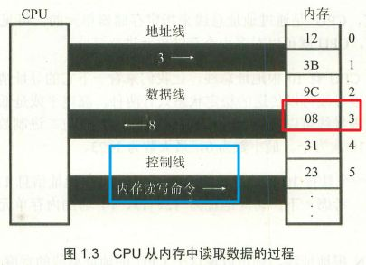

# 内存地址空间

## 总线
- 地址总线
- 控制总线
	- cpu对外部器件的控制
	- 控制总线宽度，决定了cpu对外部器件的控制能力
- 数据总线

# 寻址方式

## 直接赋值
### 立即寻址方式
	mov ah,01h 
	mov ax,'a'

### 寄存器寻址方式
	mov ax,bx
	mov dl,ch

## 使用地址
### 直接寻址方式
	mov ax,[2000h]    //ax=ds*16+2000h
	mov ax,es:[2000h]    //ax=es*16+2000h

### 寄存器间接寻址方式
	mov ax,[bx]    //ax=ds*16+bx
	mov bx,[si]    //bx=ds*16+si
	mov [di],dx    //ds*16+di=dx   #反向传，把寄存器内容传送到内存
	mov [bp],bx    //ss*16+bp=bx
	mov ax,es:[bx]    //ax=es*16+bx
	mov ds:[bp],dx    //ds*16+bp=bx

### 寄存器相对寻址方式
	mov ax,3003h[si]    //ax=ds*16+si+3003H
	mov si,08h[bx]        //si=ds*16+bx+08h
	mov ax,[bx+100h]    //ax=ds*16+bp+100h
	mov al,[bp+o8h]        //al=ss*16+bp+08h
	mov 0200h[bp],ax    //ss*16+bp+0200h=ax

### 基址加变址寻址方式
	mov ax,[bx][si]    //ax=ds*16+bx+si    

### 相对基址加变址寻址
	mov ax,mask[bx][si]    //ax=ds*16+bx+si+mask

# 内存管理
- [2.2.1 分段机制](2.2.1%20分段机制.md)
- [3.7 分页机制](3.7%20分页机制.md)