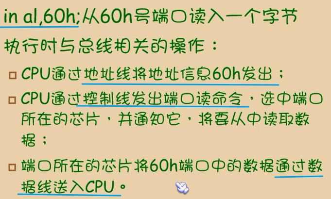

cpu从3个地方读取数据
1. 寄存器
2. 内存
3. 端口

- 寄存器、内存读写：mov、push、pop
- 端口读写：in out

## 接口芯片
- 端口，外设芯片内部有若干寄存器
- cpu/内存 -- 端口（外设芯片中的寄存器）--外设

# 端口
- 输入端口**上拉**，表示输入的为高电压
- 输入端口**下拉**，表示输入的为低电压
- 输入端口**悬空**，表示输入的为电压不确定

- 端口2
	- 开关断开时，直接连接电阻和正极，高电平
	- 开关连通时，直接连接负极，相当于负极的电压，低电平
- 端口5
	- 开关断开时，直接连接电阻和负极，低电平
	- 开关连通时，电阻自己占5v，导线直接连接正极，高电平
- 上图中有2个问题，**【已经解决，参考上边】**
	- 按下时短路，什么原理
	- 端口5，按下时，上拉。因为短路造成的，没有电阻。是否电流过大