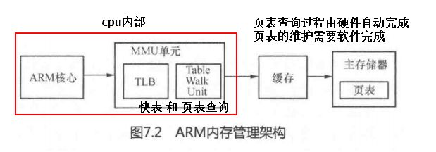

# 快表tlb
- **TLB（Translation Lookaside Buffer）**
- 多核cpu，**每个核心私有TLB**
- 其实就是高速缓冲，目的是为了减少计算物理地址的时间
- 虚拟地址的高20位 直接映射为  物理地址的高20位
- 如果某个页被访问到，则其高20位入表
- 下次在访问该表，直接在快表中访问
- 如果，不在快表中，则通过计算获取物理地址访问

## TLB结构
| LA(线性地址) | PA(物理地址) | ATTR(属性) | LRU(统计) |
| ------------ | ------------ | ---------- | --------- |

- **一核一套TLB**
- 不同的CPU这个表的大小不一样
- ATTR(属性)
	- 如果是10-10-12, 是PDE and PTE
	- 如果是2-9-9-12, 是PDPE and PDE and PTE
- LRU，**最近最久未使用**，用来控制**替换的优先级**
	- 当TLB表填满了，就会根据LRU删除优先级低的项
- **CR3改变，TLB刷新情况**
	- 立即刷新
		- 进程切换时，CR3改变，TLB就会随之刷新
		- 因为**相同的线性地址**通过**不同的CR3**会映射到**不同的物理地址**
	- 不刷新
		- 高2G映射基本不变，如果CR3改了，TLB刷新，重建高2G以上很浪费
		- **PDE和PTE中有个G标志位**，如果G位为1时，如果CR3改了，TLB将不会刷新
## TLB的种类
- 486CPU开始的
- 缓存一般页表（4K字节页面）的指令页表缓存（Instruction-TLB）
- 缓存一般页表（4K字节页面）的数据页表缓存（Data-TLB）  
- 缓存大尺寸页表（2M/4M字节页面）的指令页表缓存（Instruction-TLB） 
- 缓存大尺寸页表（2M/4M字节页面）的数据页表缓存（Instruction-TLB）
	
[3.7.3 CPU缓存](3.7.3%20CPU缓存.md)