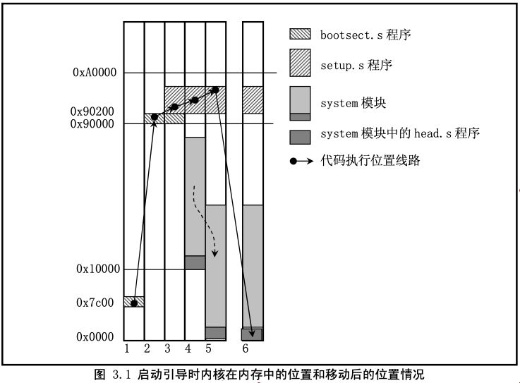
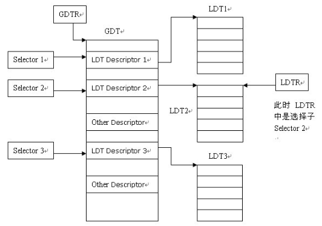

# **启动介质**
- 制作一个1.44MB的虚拟软盘
	- dd if=/dev/zero of=软盘名称.img bs=512 count=2880
- **将引导程序写入引导扇区**
	- dd if=引导程序 of=虚拟镜像 bs=512 count=1 conv=notrunc
# makefile
- boot.bin
	- 写入引导扇区
	- fat12格式
	- 注意，要把引导扇区信息填写完整
- loader.bin
- kernel.bin
	- 主要是c语言代码
	- 函数入口为0x30400，使用 -Ttext 设置

# 0X7C00
- DOC时代，最大内存为32k
- 栈位于最大内存处，1k
- 32k-1k=31k=0x7c00

# 流程
- x86 PC刚开机时CPU处于**实模式**
- 引导
	- 加电自检（POST）
	- BIOS去寻找存储介质
	- 引导扇区上的结尾是0xAA55
	- 一个扇区大小是512字节
	- 进入BIOS，**BIOS程序入口0xFFFF0**
	- CS=0xF000; IP=0xFFF0
	- **实模式的寻址CS:IP(CS左移4位+IP)**
	- 检查RAM，键盘，显示器，软硬磁盘
	- 加载引导扇区
		- **将磁盘0磁道0扇区读入0x7c00处**
		- 设置cs=0x07c0， ip=0x0000
		- 从磁盘引导扇区读入的那512个字节
		- 引导扇区就是启动设备的第一个扇区
		- 将boot.bin的内容装载到内存的0000:7c00处，然后执行
		- 将loader.bin加载到0x9000处，并执行loader
- loader
	- 跳入保护模式
	- 展示内存信息
	- 启动分页机制
	- 加载kernel.bin到内存0x8000处
	- 将kernel.bin的内容整理对齐后，放入0x30000处，此时kernel入口为0x30400
		- 根据linux elf，将program header中的段，拷贝到0x30000处
	- 根据入口0x30400，进入内核
- kernel
	- 将loader的 GDT 拷贝到 kernel 中
	- 安装IDT
		- 由硬件触发，8259A
		- 手动触发，int xx
	- 启动时钟
	- 安装进程
		- 设置进程恢复栈，regs
		- 设置进程LDT
			- 新建 ldt结构
			- 在gdt中新增ldt，根据其中的base和offset，找到真正的ldt
			- 加载ldtr

# 具体代码

## bootsect.s -- “搬运代码”
- 代码是磁盘引导块程序，驻留在磁盘的第一个扇区中
- 加电 ROM BIOS 自检后，引导扇区由 BIOS 加载到内存 0x7C00 处，然后将自己移动到内存 0x90000 处
- BIOS 中断 0x13，获取引导盘的参数（磁盘参数表），在屏幕上显示“Loading system...”
- 将 system 模块从磁盘上加载到内存 0x10000--0x90000
- system模块的长度不会超过0x80000字节（512kb），所以它并不会覆盖0x90000后面的bootset和setup模块

## setup.s -- “获取硬件配置参数“
- 利用ROM BIOS中断读取机器系统数据
- 并将这些数据保存到0x90000开始的位置(覆盖掉了 bootsect 程序所在的地方)
- 将system模块整块向下移动到内存绝对地址 0x00000 处
- 加载中断描述符寄存器和全局描述符寄存器
- 开启A20地址线，设置CPU进入保护模式
- 跳转到system模块的最前部分head.s程序继续运行

## head.s -- “正式进入linux前的工作”
- 加载数据段寄存器
- 设置中断描述符表idt，共256项，使各个表项均指向一个只报错误的哑中断程序
- 然后重新设置全局描述符表gdt，设定管理内存的分页处理机制
- 去运行main()程序
