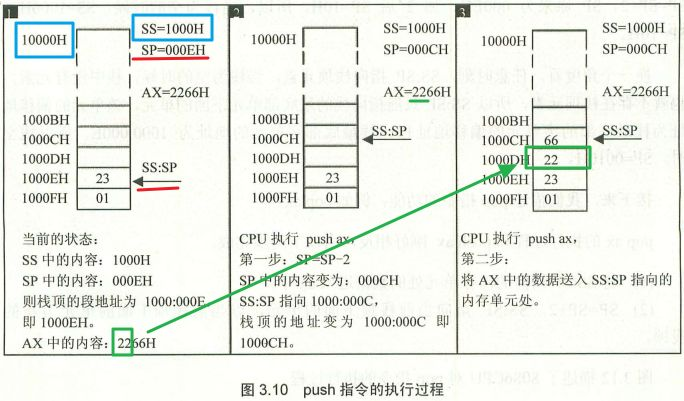
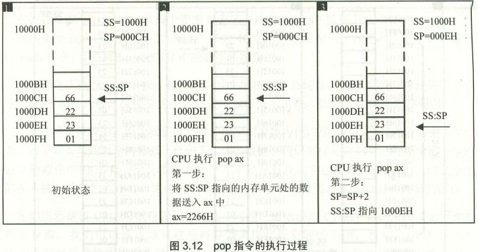
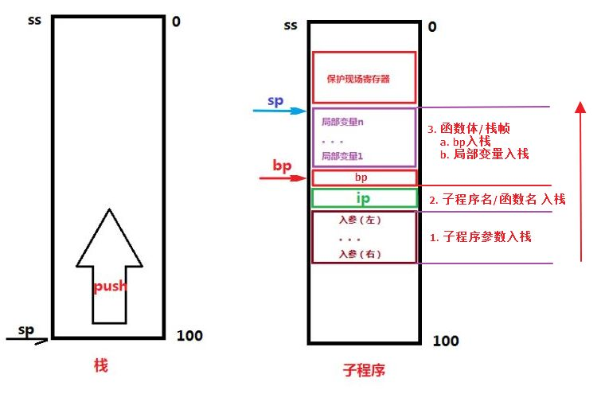
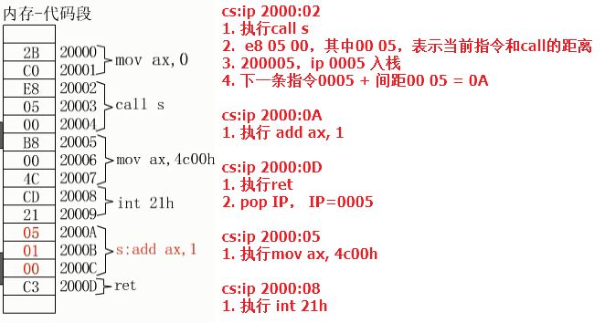
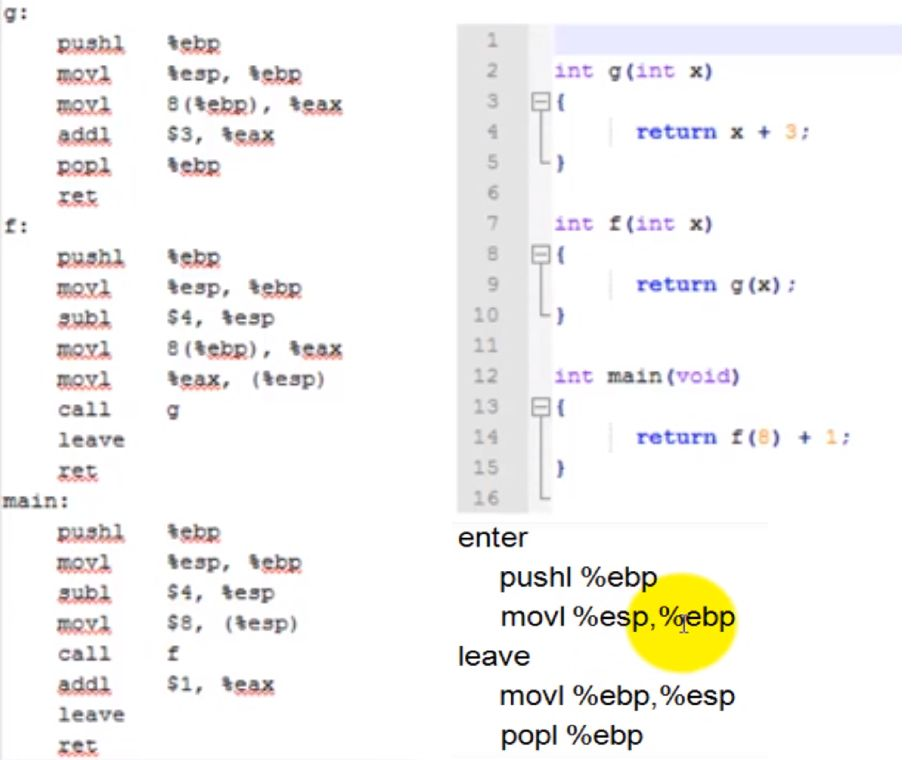
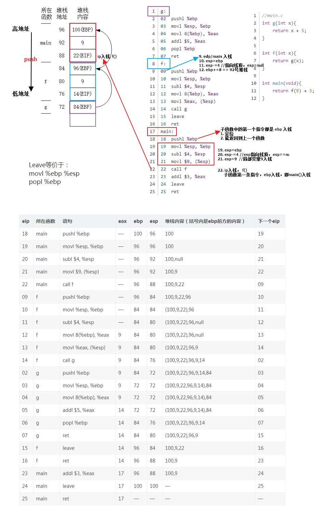

# bp与sp的区别
- SS:存放栈的段地址；
- SP:堆栈寄存器SP(stack pointer)存放栈的偏移地址;
- BP，基数指针寄存器BP(base pointer)
	- 作为**SP校准**使用的，在寻找栈里的数据时才用到
	- **bp一般是sp需要保留的一个临时变量，一般会在子程序中使用，用于区分传入的参数[bp+变量长度]、返回地址[bp]和局部变量[bp-变量长度]**
	- 比如，堆栈中压入了很多数据或地址，你肯定想通过SP来访问这些数据或者地址，但SP是要指向栈顶的，是不能随便乱改的，这时候你就需要使用BP，把SP的值传递给BP，通过BP来寻找堆栈里数据或者地址．


```
在函数进入时：
push bp  //保存bp指针
mov bp,sp //将sp指针传给bp。此时第n个参数为[bp+4+2*n]。
.....
.....
函数结束时：
mov sp,bp //将原sp指针传回给sp
pop bp  //恢复原bp的值。
ret         // 退出子函数
```
# call 和 ret
- call 标号 == ret
- call far ptr 标号 == retf

return返回的值存放位置（汇编中没有规定，应该是自己设计）
1. 堆栈
2. 寄存器
3. 内存

call 标号 / call word ptr 地址
    push IP
    jmp near ptr 标号

call far ptr 标号 / call dword ptr 地址(CS:IP == 高地址:低地址)
    push CS
    push IP
    jmp far ptr 标号

ret
    pop IP

retf
    pop IP
    pop CS

# 子程序执行流程




# 函数调用，堆栈变化

