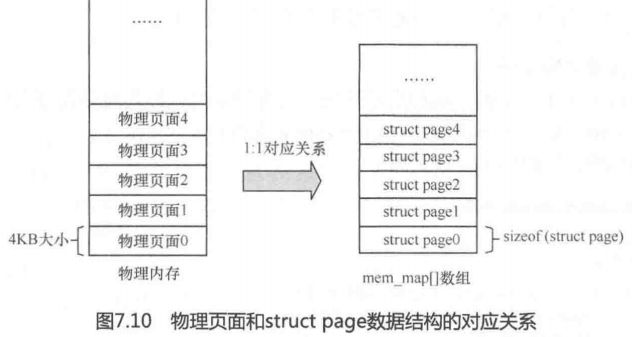

# 从虚拟地址到物理地址映射
- 计算顺序
	1. CR3 和 线性地址
	2. 页目录表PDT
	3. 页表PTT
	4. 偏移量 和 线性地址
- 
- 找到 **页目录/一级页表 的物理地址**，比如**cr3**、ttbrx
- **页目录项/页表项**，由2部分组成
	 - **地址**：指向下一层
	 - **属性**
- 线性地址拆分，找到 **页目录项/页表项 的索引**
	- 10-10-12  // C:\boot.ini 内容为execute
	- 2-9-9-12  // C:\boot.ini 内容为noexecute
- **根据索引找到表项**，表项中存储的是下一级的物理地址
- **物理地址 = 最后一层页表中找到的物理地址 + 虚拟页表中的偏移量**

# 线性地址计算

# struct page
- linux内核默认4KB，可以配置
- 对应一个struct page，该结构定义page的各种状态，比如free，lock等

