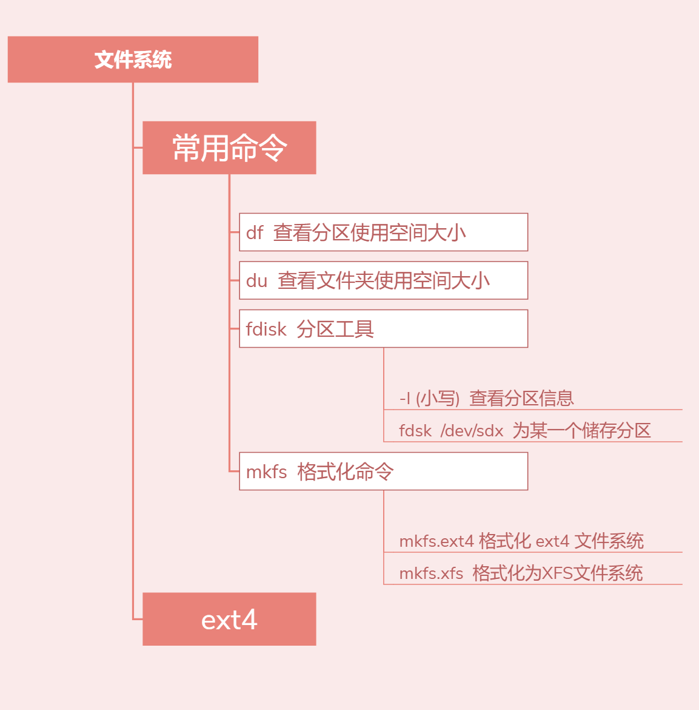

# 文件系统格式
ext2
- 1993年发布
- 最大支持16TB的分区
- 最大2TB的文件

ext3：
- 和ext2最大的区别就是带日志功能
- 支持最大16TB的分区和最大2TB的文件

ext4：
- 在性能、伸缩性和可靠性方面进行了大量改进
- 变化可以说是翻天覆地的
	- 比如向下兼容EXT3
	- 最大1EB文件系统和16TB文件（1EB=1024PB=1024*1024TB）
	- 无限数量子目录
	- Extents连续数据块概念
	- 多块分配
	- 延迟分配
	- 持久预分配
	- 快速FSCK
	- 日志校验
	- 无日志模式
	- 在线碎片整理
	- inode增强
	- 默认启用barrier

# df（disk free）
- 显示磁盘分区上可以使用的磁盘空间
	- -a    // 查看全部文件系统，单位默认KB
	- -h    // 使用-h选项以KB、MB、GB的单位来显示，可读性高

# du (disk usage)
- 显示每个文件和目录的大小
	- -h  // 以K  M  G为单位显示，提高可读性
	- --max-depth=1  // 显示层级

# dumpe2fs
- 读取文件系统的信息