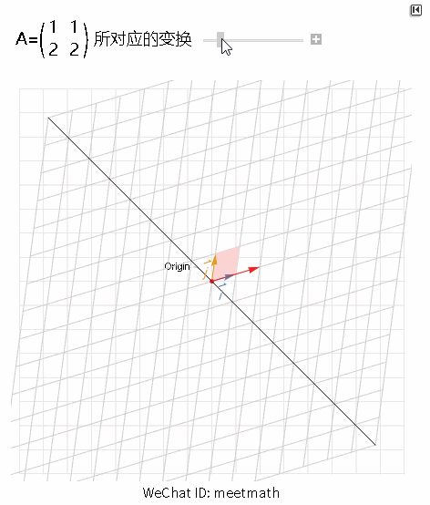

矩阵A的零空间
- 把A看作是系统：
	- A的零空间，就是Ax=0中，所有x组成的空间
	- 方程组的通解就是由**特解**和**所有零空间解**的线性组合
- 把A看作是函数（变换）：A的零空间，所有被A变化为0的向量
- 把A看作是空间：A的零空间，是和A的行空间正交的向量

# 从几何角度看
- 从 **行图像和点积** 角度看
- 行图像的点积相等，如图
- 零空间，各个图形相交后过原点；特殊解相当于从零点移动各个图形的相交点
- 参考 [01.6.3 向量乘法，向量内积 (inner  product)](01.6.3%20向量乘法，向量内积%20(inner%20%20product).md)
- 参考 [01.2 向量定义](01.2%20向量定义.md)

# 从 系统 和 变换 角度看

从列视图的角度理解无穷解的情况
- 黑色对角线被压缩到了0，零空间
- 其他解，从一条直线变为另一条直线（旋转），(2, 0) -->(2, 4)

# 从空间角度看

