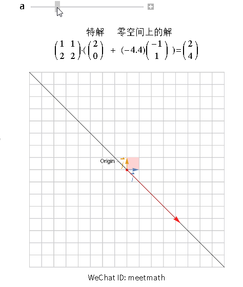

矩阵A的零空间
- 把A看作是系统：
	- A的零空间，就是Ax=0中，所有x组成的空间
	- 方程组的通解就是由**特解**和**所有零空间解**的线性组合
- 把A看作是函数（变换）：A的零空间，所有被A变化为0的向量
- 把A看作是空间：A的零空间，是和A的行空间正交的向量

# 从 系统 和 变换 角度看

从列视图的角度理解无穷解的情况
- 黑色对角线被压缩到了0，零空间
- 其他解，从

