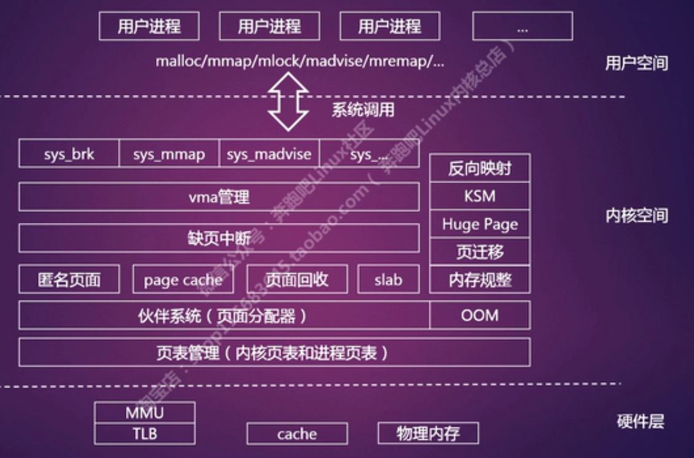

# 地址映射管理
- 看图中红框位置

# 物理内存分配
## 什么是碎片
- 内部碎片
	- 采用**slab**解决内部碎片的问题
	- **页内多余部分**
- 外部碎片
	- 采用**伙伴系统**解决外部碎片的问题
	- **未分配的连续内存区域**太小

# 伙伴系统
如何有效的避免外部碎片？
- 采用分页技术将不连续的空闲页面映射到连续的线性地址空间中
	- 每一次映射都要改写内核的页表，进而刷新TLB
- 为了保证**大块内存的连续性和完整性**，不会从大块的连续空间内截取一小段
	- 块的**大小**和**起始位置** 为 **2^n**
	- 最大页框为512连续页
	- 第5个32页框的的起始位置为： 5x32x4k x n

# slab系统内存管理
- 基于对象的内存管理  
- 提供内存的构造函数和析构函数
	- 创建slab对象： kmem_cache_create
	- 使用kmem_cache_alloc申请内存
	- 使用kmem_cache_free释放内存
