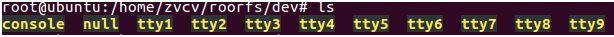

# 编译内核-linux
- 主版本.次版本.修正版本
- 进入内核代码目录
    内核目录一般放置在 /usr/src
- 内核配置，make menuconfig。
    - 内核源码默认内核配置。 linux-4.16.3/arch/x86/config/x86_64_config
    - 当前系统默认的配置文件。/boot/config-4.4.0-81-generic
    - 可以根据默认配置，进行增减配置
    　　- Y--将该功能编译进内核 
    　　- N--不将该功能编译进内核 
    　　- M--将该功能编译成可以在需要时动态插入到内核中的模块 
        - 空格--切换Y 和 N    
    - 配置完成会保存到 内核源代码根目录下的.config 文件中
- 编译内核，make 
    - 目的：生成内核模块，vmlinuz，initrd.img，Symtem.map文件
    - make -jn，分成n个任务运行来并行编译内核
    - 查看cpu核心数。 
        - cat /proc/cpuinfo processor : 7，从0开始计数
        - make –j8
- 编译和安装内核的模块
    - sudo make modules_install
- 把编译好的内核 image 安装到优麒麟 Linux 系统    
    - sudo make install

# 编译内核-arm
# ABI
- ABI(application binary interface)：二进制应用程序接口
- EABI，嵌入式ABI

## 安装ARM交叉编译工具
	sudo apt-get install gcc-arm-linux-gnueabi

## 安装qemu
	sudo apt-get install qemu

## 编译内核和设备树
	$ export ARCH=arm
	$ export CROSS_COMPILE=arm-linux-gnueabi-
	$ make vexpress_defconfig  # ./arch/arm/configs/vexpress_defconfig
	$ make menuconfig             # 编译后生成.config文件
	$ make zImage -j6   # arch/arm/boot/zImage（多线程编译，6个线程）
	$ make modules -j4  # drivers/video/backlight/*.ko
	$ make dtbs  # arch/arm/boot/dts/vexpress-v2p-ca9.dtb
	$ qemu-system-arm -M vexpress-a9 -m 512M -kernel arch/arm/boot/zImage -dtb arch/arm/boot/dts/vexpress-v2p-ca9.dtb -nographic -append "console=ttyAMA0"
	# 该命令指定了开发板类别、内存大小、内核zImage文件、设备树dtb文件、无图形界面、串口
	# 由于还未挂载根文件系统，所以VFS会有报错
	# —[ end Kernel panic - not syncing: VFS: Unable to mount root fs on unknown-block(0,0) ]
	$ ps -a|grep qemu
	$ kill 2590 #kill qemu进程

## busybox根文件系统制作
	https:#busybox.net/downloads/
	$ tar xvf busybox-1.32.0.tar.bz2
	$ cd busybox-1.32.0/
	# 配置Makefile。vim Makefile 或者 直接导出
	$ export ARCH=arm
	$ export CROSS_COMPILE=arm-linux-gnueabi-
	$ make menuconfig  #make defconfig
	# 找到Build Options，点y键将选项Build static binary（编译成静态）选中
	$ make -j4
	$ make install  #生成_install文件夹，包含了各种shell命令

## 开始制作根文件系统
	$ cd ~; mkdir rootfs; cd rootfs/
	$ cp -r /home/zvcv/Downloads/busybox-1.32.0/_install/* ./  #拷贝_install目录里的所有文件
	$ mkdir lib
	$ cp -r /usr/arm-linux-gnueabi/lib/* lib/  #将arm交叉编译器的库复制过来
	$ mkdir dev; cd dev/
	$ sudo mknod -m 666 tty1 c 4 1    #创建了一个串口字符设备，主设备号为4，从设备号为1
	$ sudo mknod -m 666 console c 5 1 #创建控制台
	$ sudo mknod -m 666 null c 1 3    #创建null

## 生成虚拟SD卡，制作系统镜像rootfs.ext3(块设备不能直接读写，需要mount)
	$ cd ~; 
	$ dd if=/dev/zero of=rootfs.ext3 bs=1M count=32 #生成虚拟sd卡，rootfs.ext3
	$ mkfs.ext3 rootfs.ext3                         #格式化该镜像
	$ mount -t ext3 rootfs.ext3 /mnt -o loop        #将虚拟sd卡挂载到/mnt
	$ cp -r /home/zvcv/rootfs/* /mnt/               #拷贝rootfs的所有文件到sd卡
	$ umount /mnt                                   #卸载sd

## 使用qemu运行内核和文件系统
	$ cd linux-4.4.232
	# 非图形化启动，比之前多指定了一个sd镜像
	$ qemu-system-arm -M vexpress-a9 -m 512M -kernel arch/arm/boot/zImage -dtb arch/arm/boot/dts/vexpress-v2p-ca9.dtb -nographic -append "root=/dev/mmcblk0 rw console=ttyAMA0" -sd /home/zvcv/rootfs.ext3
	# 图形化启动
	$ qemu-system-arm -M vexpress-a9 -m 512M -kernel arch/arm/boot/zImage -dtb arch/arm/boot/dts/vexpress-v2p-ca9.dtb -append "root=/dev/mmcblk0 rw console=tty0" -sd /home/zvcv/rootfs.ext3

# ARM交叉编译工具
## 安装ARM交叉编译工具
	sudo apt-get install gcc-arm-linux-gnueabi

## 查看版本
	arm-linux-gnueabi-gcc -v 

## 使用 update-alternatives 命令来对 GCC 工具的多个版本进行管理
```
update-alternatives --install <link> <name> <path> <priority>
- link：指向/etc/alternatives/<name>的符号引用
- name： 链接的名称
- path： 这个命令对应的可执行文件的实际路径
- priority： 优先级， 在 auto 模式下， 数字大的优先级比较高

$ sudo update-alternatives --install /usr/bin/arm-linux-gnueabi-gcc arm-linux-gnueabi-gcc /usr/bin/arm-linux-gnueabi-gcc-5 5
$ sudo update-alternatives --install /usr/bin/arm-linux-gnueabi-gcc arm-linux-gnueabi-gcc /usr/bin/arm-linux-gnueabi-gcc-7 7
$ sudo update-alternatives --config arm-linux-gnueabi-gcc  #设置使用的版本
```

# 内核和设备树arm
## 下载内核
https://www.kernel.org/
$ tar xvf linux-4.4.232.tar.xz
$ cd linux-4.4.232/

## 配置Makefile。vim Makefile 或者 直接导出

	$ export ARCH=arm
	$ export CROSS_COMPILE=arm-linux-gnueabi-

## 选择vexpress系列开发板
	$ make vexpress_defconfig  # ./arch/arm/configs/vexpress_defconfig
	$ make menuconfig             # 编译后生成.config文件

## 编译内核，生成zImage镜像文件
	#zImage生成路径：arch/arm/boot/zImage
	$ make zImage -j6（多线程编译，6个线程）

## 编译内核模块
	$ make modules -j4  # drivers/video/backlight/*.ko

## 编译设备树，获得dtb文件
	$ make dtbs  # arch/arm/boot/dts/vexpress-v2p-ca9.dtb

## 使用qemu运行内核
	$ qemu-system-arm -M vexpress-a9 -m 512M -kernel arch/arm/boot/zImage -dtb arch/arm/boot/dts/vexpress-v2p-ca9.dtb -nographic -append "console=ttyAMA0"
	该命令指定了开发板类别、内存大小、内核zImage文件、设备树dtb文件、无图形界面、串口
	由于还未挂载根文件系统，所以VFS会有报错
	ffe0: 00000000 00000000 00000000 00000000 00000013 00000000
	—[ end Kernel panic - not syncing: VFS: Unable to mount root fs on unknown-block(0,0) ]
	
# busybox根文件系统制作
## 下载busybox
	https://busybox.net/downloads/
	$ tar xvf busybox-1.32.0.tar.bz2
	$ cd busybox-1.32.0/

## 配置Makefile。vim Makefile 或者 直接导出

	$ export ARCH=arm
	$ export CROSS_COMPILE=arm-linux-gnueabi-

## 编译成静态
	$ make menuconfig  #make defconfig
	# 找到Build Options，点y键将选项Build static binary（编译成静态）选中

## install文件夹
	$ make -j4
	$ make install  #生成_install文件夹，包含了各种shell命令

## 制作根文件系统
	$ cd ~  
	$ mkdir rootfs
	$ cd rootfs/

## 拷贝_install目录里的所有文件
	$ cp -r /home/zvcv/Downloads/busybox-1.32.0/_install/* ./  

## 将arm交叉编译器的库复制过来
	$ mkdir lib
	$ cp -r /usr/arm-linux-gnueabi/lib/* lib/  

## 创建串口字符设备，控制台，null
	$ mkdir dev/
	$ cd dev/
	$ sudo mknod -m 666 tty1 c 4 1  #创建串口字符设备，主设备号为4，从设备号为1
	$ sudo mknod -m 666 tty2 c 4 2
	$ sudo mknod -m 666 tty3 c 4 3
	$ sudo mknod -m 666 tty4 c 4 4
	$ sudo mknod -m 666 console c 5 1 #创建控制台
	$ sudo mknod -m 666 null c 1 3    #创建null


## 生成虚拟SD卡，制作系统镜像rootfs.ext3(块设备不能直接读写，需要mount)
	$ cd ~
	$ dd if=/dev/zero of=rootfs.ext3 bs=1M count=32 #生成虚拟sd卡，rootfs.ext3
	$ mkfs.ext3 rootfs.ext3                                          #格式化该镜像
	$ mount -t ext3 rootfs.ext3 /mnt -o loop                #将虚拟sd卡挂载到/mnt
	$ cp -r /home/zvcv/rootfs/* /mnt/                           #拷贝rootfs的所有文件到sd卡
	$ umount /mnt                                                       #卸载sd

## 使用qemu运行内核和文件系统
	$ cd linux-4.4.232
	# 非图形化启动，比之前多指定了一个sd镜像
	$ qemu-system-arm -M vexpress-a9 -m 512M -kernel arch/arm/boot/zImage -dtb arch/arm/boot/dts/vexpress-v2p-ca9.dtb -nographic -append "root=/dev/mmcblk0 rw console=ttyAMA0" -sd /home/zvcv/rootfs.ext3
	# 图形化启动
	$ qemu-system-arm -M vexpress-a9 -m 512M -kernel arch/arm/boot/zImage -dtb arch/arm/boot/dts/vexpress-v2p-ca9.dtb -append "root=/dev/mmcblk0 rw console=tty0" -sd /home/zvcv/rootfs.ext3

# qemu
## 安装qemu
	sudo apt-get install qemu

## 常用命令
	qemu-system- tab          #查看qemu支持的CPU架构
	qemu-system-arm --version #查看qemu的版本。
	qemu-system-arm -M help   #查看支持的开发板类别。

