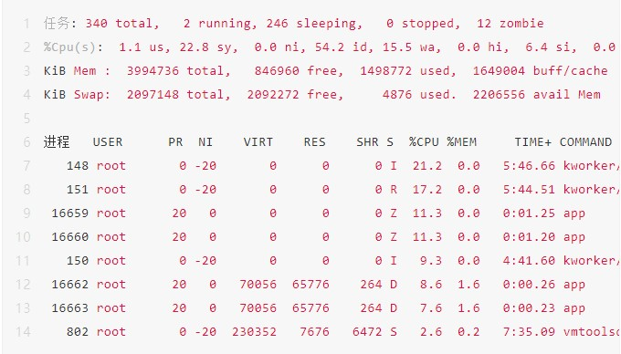

# 进程四要素
1. 有一段程序供其执行
2. 专用的**内核空间堆栈**
3. 在内核中有一个task_struct数据结构, **PCB(进程控制块)**
4. 有**独立的用户空间**

 用户空间
- 进程，**有独立的**用户空间
- 用户线程，**有共享的**用户空间
- 内核线程， **无**用户空间

# Linux进程状态
- TASK_RUNNING，可执行状态（执行状态、就绪状态）
- TASK_INTERRUPTIBLE，等待状态，可以被wake_up()和信号唤醒
- TASK_UNINTERRUPTIBLE，等待状态，只能被wake_up()唤醒

![[../photo/7fd07ff2ef07092e59ea1b4195aa38a8_MD5.png]]

top 和 ps 是最常用的查看进程状态的工具，下面是 top 命令输出的示例，S 列(也就是 Status 列)表示进程的状态。

top 和 ps 是最常用的查看进程状态的工具，下面是 top 命令输出的示例，S 列(也就是 Status 列)表示进程的状态。

[![[../photo/39c82ead25d02f20d9c2b6fed61d1743_MD5.png]]
变为就绪态等待系统调用。

![[../photo/3ff28a5bec852d0e7b19f890032508d6_MD5.png]]

top 和 ps 是最常用的查看进程状态的工具，下面是 top 命令输出的示例，S 列(也就是 Status 列)表示进程的状态。

[![[../photo/39c82ead25d02f20d9c2b6fed61d1743_MD5.png]]](https://file.elecfans.com/web2/M00/7D/6D/poYBAGN_I02AOckxAAEU_IfRenc592.png)