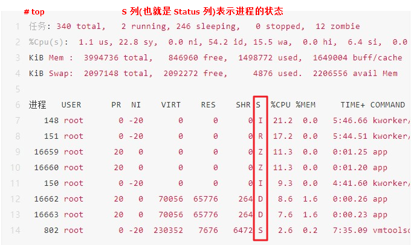

# 进程四要素
1. 有一段程序供其执行
2. 专用的**内核空间堆栈**
3. 在内核中有一个task_struct数据结构, **PCB(进程控制块)**
4. 有**独立的用户空间**

 用户空间
- 进程，**有独立的**用户空间
- 用户线程，**有共享的**用户空间
- 内核线程， **无**用户空间

# Linux进程状态
- TASK_RUNNING，可执行状态（执行状态、就绪状态）
- TASK_INTERRUPTIBLE，等待状态，可以被wake_up()和信号唤醒
- TASK_UNINTERRUPTIBLE，等待状态，只能被wake_up()唤醒




```
static const char * const task_state_array[] = {
	"R (running)", /* 0 */
	"S (sleeping)", /* 1 Interruptible Sleep*/
	"D (disk sleep)", /* 2 Uninterruptible Sleep*/
	"T (stopped)", /* 4 */
	"t (tracing stop)", /* 8 */
	"X (dead)", /* 16 */
	"Z (zombie)", /* 32 Zombie*/
};
```

# 调度策略
- SCHED_NORMAL(SCHED_OTHER):普通的分时进程
- SCHED_FIFO :先入先出的实时进程
- SCHED_RR：时间片轮转的实时进程
- SCHED_BATCH:批处理进程
- SCHED_IDLE: 只在系统空闲时才能够被调度执行的进程

# 调度时机 - schedule()函数什么时候被调用
- 主动式调度
	- 直接调用schedule()
	- 进程需要等待资源等而暂时停止运行时
		current->state = TASK_INTERRUPTIBLE; 
		schedule();
- 被动式调度又名：抢占式调度
	- 用户态抢占(Linux2.4、Linux2.6)
	 - 内核态抢占(Linux2.6)

