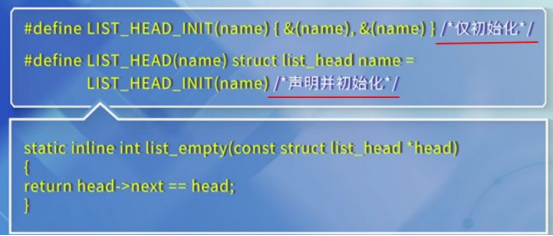
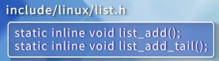
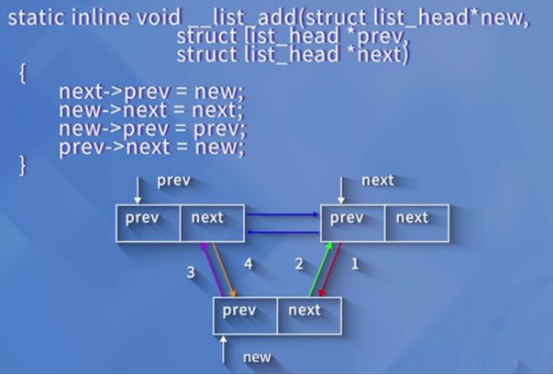
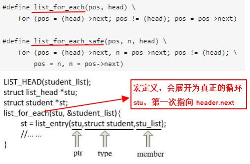
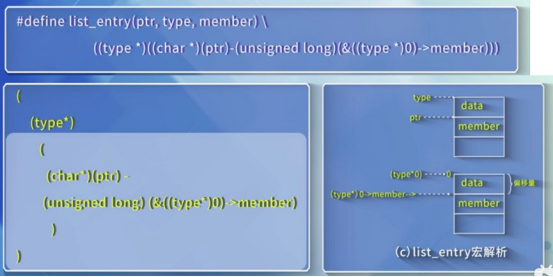

# 原理


```
// 计算MEMBER在TYPE中的距离
#define offsetof(TYPE, MEMBER) ((size_t) &((TYPE *)0)->MEMBER)

// 获取整个结构体变量的指针。
// 成员：
// 	结构体(type)
// 	域成员变量(member)
// 	type->member的指针(ptr)
// 算法：
// 	成员指针地址-减去成员指针距离
#define container_of(ptr, type, member) ({          \
    const typeof( ((type *)0)->member ) *__mptr = (ptr);    \
    (type *)( (char *)__mptr - offsetof(type,member) );})  
```

# 函数纵览
1. INIT_LIST_HEAD:创建链表
2. list_add：在链表头插入节点
3. list_add_tail：在链表尾插入节点
4. list_del：删除节点
5. list_entry：取出节点
6. list_for_each：遍历链表

# 函数详情
## 测试offsetof
```
struct student
{
    char gender;
    char name[20];
};
int gender_offset = offsetof(struct student, gender);
printf("gender_offset = %d\n", gender_offset);
```

## 链表节点定义
```
struct list_head {
    struct list_head *next, *prev;
};
```

## 链表的声明和初始化
 

## 添加节点，添加在头部或者尾部，都是通过header来操作的

 

 

## 删除节点
```
static inline void __list_del(struct list_head * prev, struct list_head * next)
{
    next->prev = prev;
    prev->next = next;
}

static inline void list_del(struct list_head *entry)
{
    __list_del(entry->prev, entry->next);
}
```

## 替换节点
```
static inline void list_replace(struct list_head *old,
                struct list_head *new)
{
    new->next = old->next;
    new->next->prev = new;
    new->prev = old->prev;
    new->prev->next = new;
}
```

## 判断双链表是否为空
```
static inline int list_empty(const struct list_head *head)
{
    return head->next == head;
}
```

## 遍历链表 和 获取节点

 

