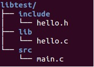

- 动态链接库（通常以.so结尾）
- 静态链接库（通常以.a结尾）
- 默认情况下，链接时优先使用动态链接库(动态链接库不存在时才考虑使用静态链接库)
	- -static选项，强制使用静态链接库



# 静态库
## 编译静态库(.c -> .o)
```
gcc -c –static -I../include hello.c	#-static可选
- 生成目标文件hello.o
- -I添加头文件搜索目录
- 
```

## 生成静态库(.o -> .a)
