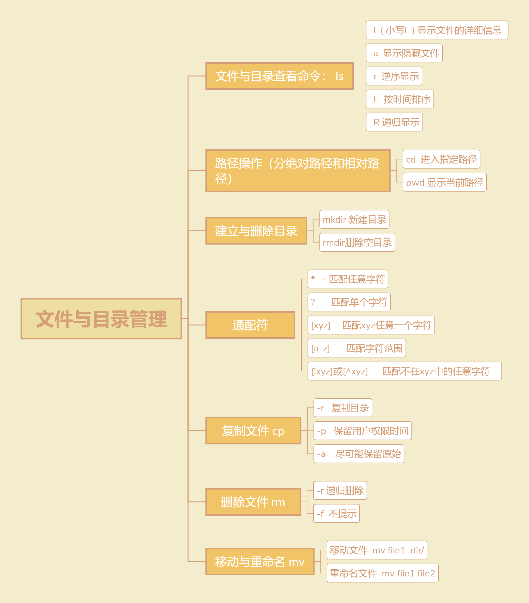
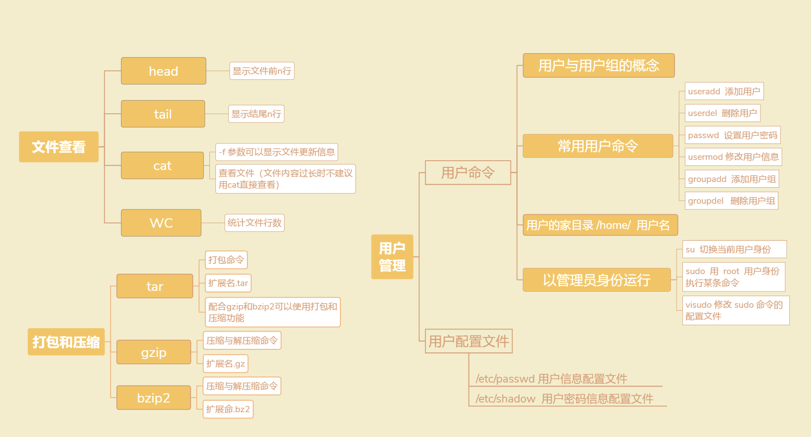

# 常用目录
```
-root，存放root用户的相关文件
-boot，存放引导系统启动的相关文件

-etc，存放配置的相关文件
-var，存放经常变化的文件，如网络连接的sock文件
-usr，安装一个软件的默认目录，相当于windows下的program files
-bin，存放常用命令的目录，如vi，su
-sbin，要具有一定权限才可以使用命令

-mnt，默认挂载光驱和软驱的目录
```

