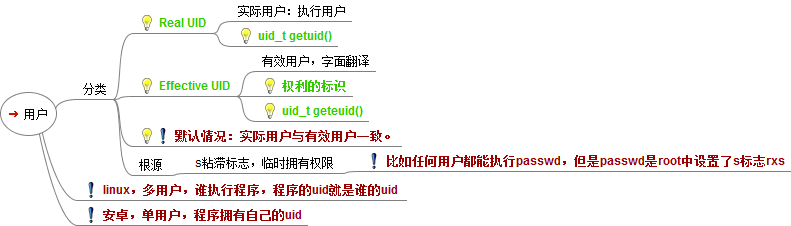

# 权限
- chown 用户名 文件名
- chgrp 组名 文件名
- chmod 改变文件或目录的权限
- 
- groupadd 组名，在linux中添加组
- useradd ‐g 组名 用户名，创建用户的同时指定将该用户分配到哪个组下
- usermod 改变用户权限
	- usermod ‐g 组名 用户名，改变用户所在组
	- usermod ‐d 目录名 用户名，改变该用户登录的初始目录

# chattr：修改文件系统的权限属性
- 专门用来修改文件或目录的隐藏属性，只有 root 用户可以使用
- lsattr

```
chattr [+-=] [属性] 文件或目录名
- + ：在原有参数设定基础上，追加参数。
- - ：在原有参数设定基础上，移除参数。
- = ：更新为指定参数设定。
- i	
	- 对文件设置，不允许对文件进行删除、改名，也不能修改数据；
	- 对目录设置，只能修改目录下文件中的数据，但不允许建立和删除文件；
- a, 即append
	- 对文件设置，只能在文件中増加数据，但是不能删除和修改数据；
	- 对目录设置，只允许在目录中建立和修改文件，但是不允许删除文件；
- u	
	- 对文件或目录，在删除时，其内容会被保存，以保证后期能够恢复
	- 常用来防止意外删除文件或目录。
- s	
	- 和 u 相反，删除文件或目录时，会被彻底删除（直接从硬盘上删除，然后用 0 填充所占用的区域），不可恢复。

- A：文件或目录的 atime (access time)不可被修改(modified)
- S：硬盘I/O同步选项，功能类似sync
- c：即compresse，设定文件是否经压缩后再存储。读取时需要经过自动解压操作。
```

# 用户
## UID
- 系统用户的UID的值从0开始，是一个正整数
- 最大值（UID_MAX）在/etc/login.defs 可以查到，一般Linux发行版约定为60000；
- 最小值（UID_MIN）在/etc/login.defs 可以查到，一般Linux发行版约定为500；

## 分类
- 超级用户（root），UID值均为0
- 普通用户，UID值500~6000
- 伪用户，与真实用户区分开来

# 组
## GID
- GID的值从0开始，是一个正整数
- 0~499传统上是保留给系统帐号使用。
- 最小值（GID_MIN）
	- 在/etc/login.defs 可以查到
	- 一般Linux发行版约定为500；
- 最大值（GID_MAX）
	- 在/etc/login.defs 可以查到
	- 一般Linux发行版约定为60000；

## 分类
- 标准组(G)
- 私有组（g）
	- 新建用户时，若没有指定他所属于的组，会建立一个和该用户同名的私有组

## 组配置文件
- 组配置文件：/etc/group
- **组名：组口令（一般不使用）：GID：组内用户列表**
```
root:x:0:root,linuxsir   注：用户组root，x是密码段，表示没有设置密码，GID是0,root用户组下包括root、linuxsir以及GID为0的其它用户（可以通过/etc/passwd查看）；；

  
beinan:x:500:linuxsir  注：用户组beinan，x是密码段，表示没有设置密码，GID是500,beinan用户组下包括linuxsir用户及GID为500的用户（可以通过/etc/passwd查看）；

  
linuxsir:x:502:linuxsir  注：用户组linuxsir，x是密码段，表示没有设置密码，GID是502,linuxsir用户组下包用户linuxsir及GID为502的用户（可以通过/etc/passwd查看）；

  
helloer:x:503:   注：用户组helloer，x是密码段，表示没有设置密码，GID是503,helloer用户组下包括GID为503的用户，可以通过/etc/passwd查看；
```

## 组的影子文件
- /etc/gshadow
- gpasswd   //用户组设置密码
- grpconv    //通过/etc/group，同步或创建/etc/gshadow
- grpunconv
```
/etc/gshadow 格式如下，每个用户组独占一行；
groupname:password:admins:members
第一字段：用户组
第二字段：用户组密码，这个段可以是空的或!，如果是空的或有!，表示没有密码；
第三字段：用户组管理者，这个字段也可为空，如果有多个用户组管理者，用,号分割；
第四字段：组成员，如果有多个成员，用,号分割；

举例： 
beinan:!::linuxsir
linuxsir:oUS/q7NH75RhQ::linuxsir
第一字段：这个例子中，有两个用户组beinan用linuxsir
第二字段：用户组的密码，beinan用户组无密码；linuxsir用户组有已经，已经加密；
第三字段：用户组管理者，两者都为空；
第四字段：beinan用户组所拥有的成员是linuxsir ， linuxsir 用户组有成员linuxisir ；
```

## 组操作
- groupadd
- groupdel
- groupmod
- groups 查
- 
- newgrp
	- 当一个用户同时属于多个用户组，用户可以在用户组之间进行切换
	- newgrp root 将当前用户切换到root用户组
```
#groupadd -g 888 group2 == 创建一个组group2，其GID为888
#groupdel group2 == 删除组group2

groupmod option groupname
	-g    GID        为用户组指定新的组标识号。
	-n    新用户组    将用户组的名字改为新的用户组名。
#groupmod -n group22 group2 == 修改group2组名为group22
groupmod -g 105 group2
groupmod -g 111111 -n group3 group2


$ groups linuxsir    注：查询linuxsir用户所归属的用户组；  
linuxsir : linuxsir root beinan  注：linuxsir 是 用户组linuxsir、beinan和root 的成员
```