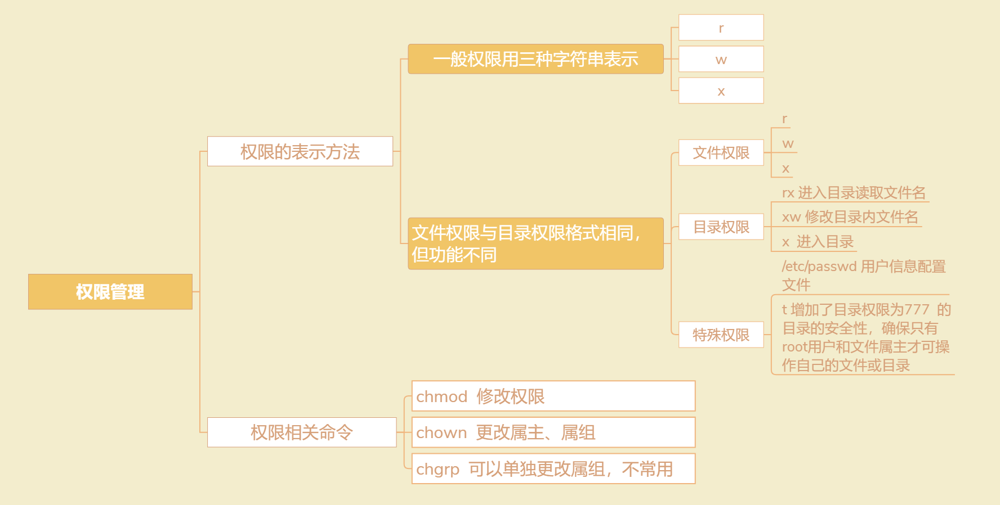

# chattr：修改文件系统的权限属性
- 专门用来修改文件或目录的隐藏属性，只有 root 用户可以使用
- lsattr

```
chattr [+-=] [属性] 文件或目录名
- + ：在原有参数设定基础上，追加参数。
- - ：在原有参数设定基础上，移除参数。
- = ：更新为指定参数设定。
- i	
	- 对文件设置，不允许对文件进行删除、改名，也不能修改数据；
	- 对目录设置，只能修改目录下文件中的数据，但不允许建立和删除文件；
- a, 即append
	- 对文件设置，只能在文件中増加数据，但是不能删除和修改数据；
	- 对目录设置，只允许在目录中建立和修改文件，但是不允许删除文件；
- u	
	- 对文件或目录，在删除时，其内容会被保存，以保证后期能够恢复
	- 常用来防止意外删除文件或目录。
- s	
	- 和 u 相反，删除文件或目录时，会被彻底删除（直接从硬盘上删除，然后用 0 填充所占用的区域），不可恢复。

- A：文件或目录的 atime (access time)不可被修改(modified)
- S：硬盘I/O同步选项，功能类似sync
- c：即compresse，设定文件是否经压缩后再存储。读取时需要经过自动解压操作。
```
