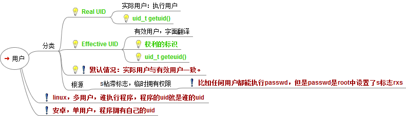

# 用户
## UID
- 系统用户的UID的值从0开始，是一个正整数
- 最大值（UID_MAX）在/etc/login.defs 可以查到，一般Linux发行版约定为60000；
- 最小值（UID_MIN）在/etc/login.defs 可以查到，一般Linux发行版约定为500；


## 分类
- 超级用户（root），UID值均为0
- 普通用户，UID值500~6000
- 伪用户，与真实用户区分开来。**UID值1~499**
	-  1~99 会保留给系统预设的帐号，另外 100~499 则保留给一些服务来使用
	- **不具有登录**系统的能力
	- 大部分是系统自身拥有的，当然我们也可以添加虚拟用户；
	- 伪用户是为了方便系统管理，满足响应的系统进程文件属主的要求，比如bin、daemon、adm、ftp、mail等

## 口令文件
- /etc/passwd
- 用户名:密码:uid:gid:用户描述:主目录:登陆shell
- pp : x : 500 : 500 : pengpeng : /home/pp : /bin/bash

```
账号名称：在系统中是唯一的
用户密码：x，表示该口令已经加密, 其实真正的加密密码已被映射到/etc/shadow 文件中
用户标识码（User ID）：系统内部用它来标识用户
组标识码（Group ID）：系统内部用它来表示用户属性
用户相关信息： 例如用户全名等
用户目录：用户登陆系统后所进入的目录
用户环境：用户工作的环境，负责解释用户所输入的命令让系统以了解用户要做什么事情，Linux默认为bash
```

## 影子口令文件
- /etc/shadow
- 用户名:口令:最近更动密码的日期:密码不可被更动的天数: 密码需要重新变更的天数:提前多少天警告用户口令将过期:在口令过期之后多少天禁用此用户；标志（未使用）
	- beinan:$1$VE.Mq2Xf$2c9Qi7EQ9JP8GKF8gH7PB1:13072:0:99999:7:::
- 
- passwd
- pwcov 根据/etc/passwd，同步/etc/shadow
- pwunconv
- pwck 校验用户配置文件/etc/passwd 和/etc/shadow 文件内容是否合法或完整

## 用户操作
- useradd/adduser
- newusers、chpasswd 批量添加用户
- userdel
- usermod
	- usermod ‐g 组名 用户名，改变用户所在组
	- usermod ‐d 目录名 用户名，改变该用户登录的初始目录
- who、w、users
- id
- finger 侧重于用户信息的查询
- chfn 用来改用户的全名，办公室地址，电话之类的
- `chfn  [-f full-name] [-o office] [-p office-phone] [-h home-phone] [-u] [-v] [username]`
- chsh 改变用户的SHELL
- `chage [-l] [-m 最小天数] [-M 最大天数] [-W 警告] [-I 失效日] [-E 过期日] [-d 最后日] 用户`

# 组
## GID
- GID的值从0开始，是一个正整数
- 0~499传统上是保留给系统帐号使用。
- 最小值（GID_MIN）
	- 在/etc/login.defs 可以查到
	- 一般Linux发行版约定为500；
- 最大值（GID_MAX）
	- 在/etc/login.defs 可以查到
	- 一般Linux发行版约定为60000；

## 分类
- 标准组(G)
- 私有组（g）
	- 新建用户时，若没有指定他所属于的组，会建立一个和该用户同名的私有组

## 组配置文件
- 组配置文件：/etc/group
- **组名：组口令（一般不使用）：GID：组内用户列表**
```
root:x:0:root,linuxsir   注：用户组root，x是密码段，表示没有设置密码，GID是0,root用户组下包括root、linuxsir以及GID为0的其它用户（可以通过/etc/passwd查看）；；

  
beinan:x:500:linuxsir  注：用户组beinan，x是密码段，表示没有设置密码，GID是500,beinan用户组下包括linuxsir用户及GID为500的用户（可以通过/etc/passwd查看）；

  
linuxsir:x:502:linuxsir  注：用户组linuxsir，x是密码段，表示没有设置密码，GID是502,linuxsir用户组下包用户linuxsir及GID为502的用户（可以通过/etc/passwd查看）；

  
helloer:x:503:   注：用户组helloer，x是密码段，表示没有设置密码，GID是503,helloer用户组下包括GID为503的用户，可以通过/etc/passwd查看；
```

## 组的影子文件
- /etc/gshadow
- gpasswd   //用户组设置密码
- grpconv    //通过/etc/group，同步或创建/etc/gshadow
- grpunconv
```
/etc/gshadow 格式如下，每个用户组独占一行；
groupname:password:admins:members
第一字段：用户组
第二字段：用户组密码，这个段可以是空的或!，如果是空的或有!，表示没有密码；
第三字段：用户组管理者，这个字段也可为空，如果有多个用户组管理者，用,号分割；
第四字段：组成员，如果有多个成员，用,号分割；

举例： 
beinan:!::linuxsir
linuxsir:oUS/q7NH75RhQ::linuxsir
第一字段：这个例子中，有两个用户组beinan用linuxsir
第二字段：用户组的密码，beinan用户组无密码；linuxsir用户组有已经，已经加密；
第三字段：用户组管理者，两者都为空；
第四字段：beinan用户组所拥有的成员是linuxsir ， linuxsir 用户组有成员linuxisir ；
```

## 组操作
- groupadd
- groupdel
- groupmod
- groups 查
- 
- newgrp
	- 当一个用户同时属于多个用户组，用户可以在用户组之间进行切换
	- newgrp root 将当前用户切换到root用户组
```
#groupadd -g 888 group2 == 创建一个组group2，其GID为888
#groupdel group2 == 删除组group2

groupmod option groupname
	-g    GID        为用户组指定新的组标识号。
	-n    新用户组    将用户组的名字改为新的用户组名。
#groupmod -n group22 group2 == 修改group2组名为group22
groupmod -g 105 group2
groupmod -g 111111 -n group3 group2


$ groups linuxsir    注：查询linuxsir用户所归属的用户组；  
linuxsir : linuxsir root beinan  注：linuxsir 是 用户组linuxsir、beinan和root 的成员
```