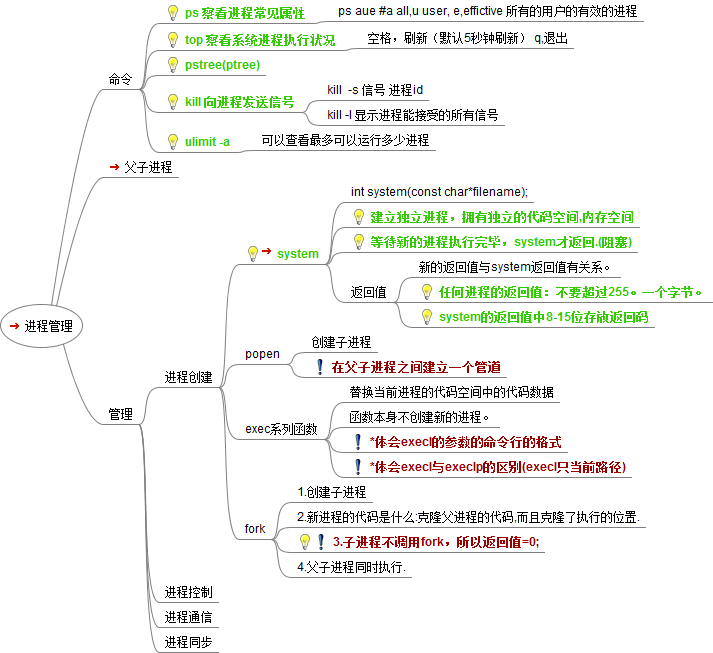
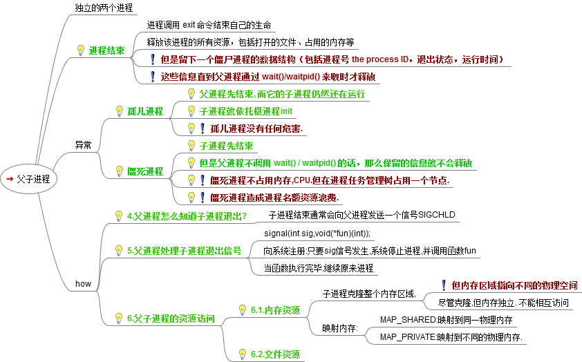

# ps
- ps -ef
	- System V风格，显示的项目有：UID , PID , PPID , C , STIME , TTY , TIME , CMD
	- 查看进程的**父进程ID和完整的COMMAND命令**
	- COMMADN列如果过长，**不会会截断显示**
- ps -aux
	- BSD风格，显示的项目有：USER , PID , %CPU , %MEM , VSZ , RSS , TTY , STAT , START , TIME , COMMAND
	- 查看进程的**CPU占用率和内存占用率**
	- COMMADN列如果过长，**会截断显示**

# kill/killall
- killall：杀死同名的所有进程
- kill：终止某个进程
	- kill 16251：终止进程号为16251的进程
	- kill -9 16251：因为有些进程会捕捉某些信号，如果直接不能结束进程可以用“-9”传送信息

# top
- 动态监控进程
- 监视特定用户
	- top：输入此命令，按回车键，查看执行的进程
	- u：然后输入“u”回车，再输入用户名，即可
- 终止指定的用户进程
	- top：输入此命令，按回车键，查看执行的进程
	- k：然后输入“k”回车，再输入要结束的进程ID号
- 指定系统状态更新的时间
	- top ‐d 10：指定系统更新进程的时间为10秒

- 1:52，表示**系统启动了多久**
- 1 user，用户数
- load average：0.00 0.00 0.00，**负载情况**，越小越轻松，当>0.6时，系统就很紧张了
- 38 processes，进程数
- 0 zombie，僵尸进程数
- CPU states：99.3% idle，闲置的CPU
- Mem，内存
- Swap，类似于虚拟内存