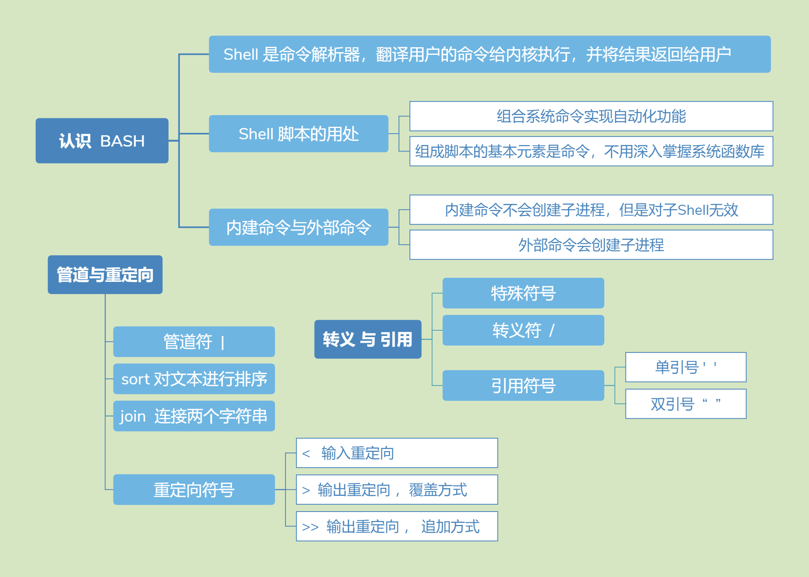

# 命令执行时顺序
1. 执行用绝对路径或相对路径执行的命令。
2. 执行别名。
3. 执行Bash的内部命令。
4. 执行按照$PATH环境变量定义的目录查找顺序找到的第一个命令。

# Bash常用快捷键
- ctrl+A 把光标移动到命令行开头。
- ctrl+E 把光标移动到命令行结尾。
- ctrl+C 强制终止当前的命令。
- ctrl+L 清屏， 相当于clear命令。
- ctrl+U 删除或剪切光标之前的命令。 
- ctrl+K 删除或剪切光标之后的内容。
- ctrl+Y 粘贴ctrl+U或ctrl+K剪切的内容。
- ctrl+R 在历史命令中搜索， 按下ctrl+R之后， 就会出现搜索界面
- ctrl+D 退出当前终端。
- ctrl+Z 暂停， 并放入后台。 
- ctrl+S 暂停屏幕输出。
- ctrl+Q 恢复屏幕输出。

# 特殊符号
```
?    匹配一个任意字符
*    匹配0个或任意多个任意字符， 也就是可以匹配任何内容
[]   匹配中括号中任意一个字符
[-]  匹配中括号中任意一个字符， -代表一个范围
[^]  逻辑非， 表示匹配不是中括号内的一个字符
''   在单引号中所有的特殊符号都没有特殊含义。
""   在双引号中特殊符号都没有特殊含义，但是“ $” 、 “ `”和“\” 是例外
`    反引号括起来的内容是系统命令， 在Bash中会先执行它。
$()  和反引号作用一样， 用来引用系统命令。推荐使用
#    #开头的行代表注释。
$    得到变量的值， 。如$name
\    转义符， 跟在\之后的特殊符号将失去特殊含义， 变为普通字符。

```

# $系统变量
```
- $# : 命令行参数个数
- $* : 表示命令行中所有的参数， $*把所有的参数看成一个整体
- $@ : 表示命令行中所有的参数， 不过$@把每个参数区分对待
- $0 : 表示程序名称
- $1 : 表示第一个命令行参数
- $? : 前一条命令的返回码
- $$ : 本进程的进程ID
- $! : 上一进程的进程ID

例子： $*与$@的区别  
#!/bin/bash  
for i in "$*"   #$*中的所有参数看成是一个整体，所以这个for循环只会循环一次  
	do  
		echo "The parameters is: $i"  
	done  
	
x=1  
for y in "$@"  #$@中的每个参数都看成是独立的，所以“$@”中有几个参数，就会循环几次  
	do  
		echo "The parameter$x is: $y"  
		x=$(( $x +1 ))  
	done
```

# 本地变量
```
变量定义
[root@localhost ~]# name="shen chao"
[root@localhost ~]# aa=123
[root@localhost ~]# aa="$aa"456
[root@localhost ~]# aa=${aa}789

变量调用
[root@localhost ~]# echo $name

变量查看
[root@localhost ~]# set

变量删除
[root@localhost ~]# unset name
```

# 接收键盘输入
```
read [选项] [变量名]
选项：
	-p “提示信息”：在等待read输入时，输出提示信息
	-t 秒数： read命令会一直等待用户输入，使用此选项可以指定等待时间
	-n 字符数： read命令只接受指定的字符数，就会执行
	-s： 隐藏输入的数据，适用于机密信息的


read -t 30 -p "Please input your name: " name
#提示“请输入姓名”并等待30秒，把用户的输入保存入变量name中

read -s -t 30 -p "Please enter your age: " age
#年龄是隐私，所以我们用“-s”选项隐藏输入

read -n 1 -t 30 -p "Please select your gender[M/F]: " gender
#使用“-n 1”选项只接收一个输入字符就会执行（都不用输入回车）
echo -e "\n"
echo "Sex is $gender"
```
# declare声明变量类型
```
declare [+/-][选项] 变量名
选项：
	-： 给变量设定类型属性
	+： 取消变量的类型属性
	-i： 将变量声明为整数型（integer）
	-x： 将变量声明为环境变量
	-p： 显示指定变量的被声明的类型
```

# 变量测试与内容替换
| 变量置换方式     | y没有设置            | y为空值             | y设置值          |
|------------|------------------|------------------|---------------|
| x=${y-新值}  | x=新值             | x为空              | x=$y          |
| x=${y:-新值} | x=新值             | x=新值             | x=$y          |
| x=${y+新值}  | x为空              | x=新值             | x=新值          |
| x=${y:+新值} | x为空              | x为空              | x=新值          |
| x=${y=新值}  | x=新值<br/>y=新值    | x为空<br/>y值不变     | x=$y<br/>y值不变 |
| x=${y:=新值} | x=新值<br/>y=新值    | x=新值<br/>y=新值    | x=$y<br/>y值不变 |
| x=${y?新值}  | 新值输出到标准<br/>错误输出 | x为空              | x=$y          |
| x=${y:?新值} | 新值输出到标准<br/>错误输出 | 新值输出到标准<br/>错误输出 | x=$y          |
