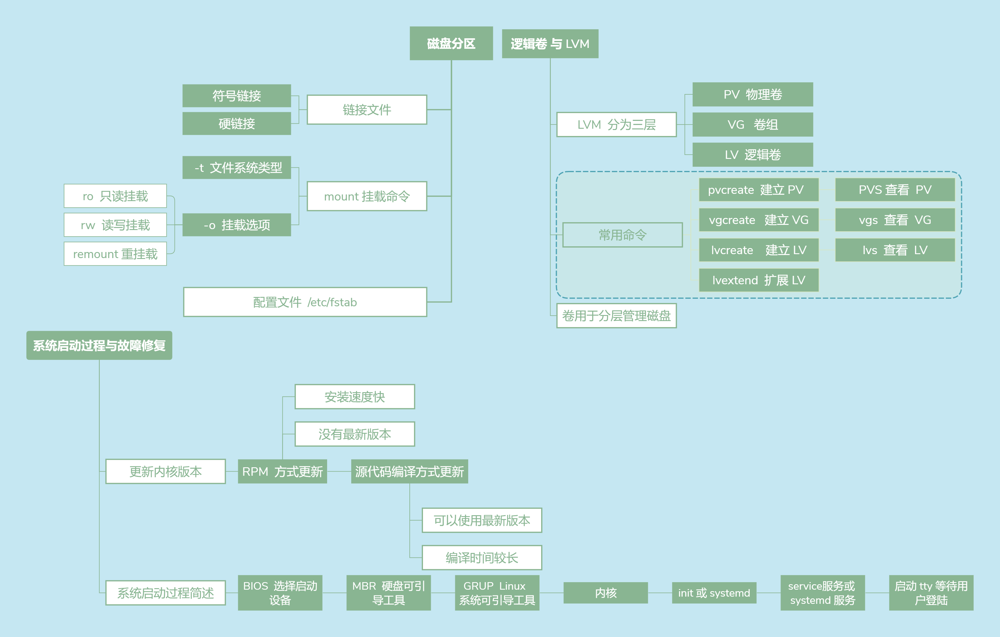

# 分区
- 基本分区和扩展分区的数目之和**不能大于4个**
- **基本分区（Primary Portion）**，**不能再分区**
- **扩展分区（Extension Portion）**，**进行分区后才能使用**
	- **逻辑分区（Logical Portion）**，而且逻辑分区没有数量上限制


# fdisk
- 查看linux**系统分区**具体情况
- `fdisk  [‐l] 设备名称`
- fdisk 设备名称
	- 进入fdisk
	- n新建分区,d删除分区,p列出当前的分区,q不存储离开,w写入分区表后离开

# 磁盘格式化
```
mke2fs [-bicLj] 设备名称	
- -b : 可以设置每个块的大小,当前支持1024、2048、4096字节3种。
- -I : 给一个inode多少容量
- -c : 检查磁盘错误，会进行快速读取测试
- -c –c，会测试读写（read-write），很慢。
- -L : 后面可以接卷材（Labe1），这个卷材是有用的。
- -j : 本来mke2fs是EXT2， 加上-j后，会主动加入日志ext3.
```

# 磁盘检验
- `fsck [-AtCary] 设备名称`
- `badblocks [-svw] 设备名称`