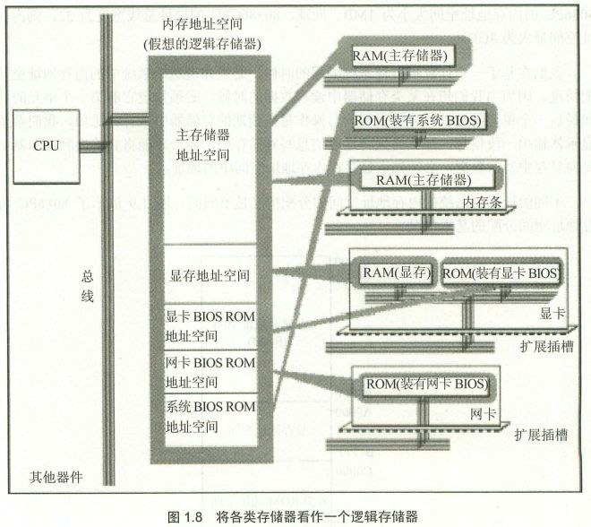

# 内存地址空间

## 总线
- 地址总线
- 控制总线
	- cpu对外部器件的控制
	- 控制总线宽度，决定了cpu对外部器件的控制能力
- 数据总线

## linux0.11内核

# 寻址方式

## 直接赋值
### 立即寻址方式
	mov ah,01h 
	mov ax,'a'

### 寄存器寻址方式
	mov ax,bx
	mov dl,ch

## 使用地址
### 直接寻址方式
	mov ax,[2000h]    //ax=ds*16+2000h
	mov ax,es:[2000h]    //ax=es*16+2000h

### 寄存器间接寻址方式
	mov ax,[bx]    //ax=ds*16+bx
	mov bx,[si]    //bx=ds*16+si
	mov [di],dx    //ds*16+di=dx   #反向传，把寄存器内容传送到内存
	mov [bp],bx    //ss*16+bp=bx
	mov ax,es:[bx]    //ax=es*16+bx
	mov ds:[bp],dx    //ds*16+bp=bx

### 寄存器相对寻址方式
	mov ax,3003h[si]    //ax=ds*16+si+3003H
	mov si,08h[bx]        //si=ds*16+bx+08h
	mov ax,[bx+100h]    //ax=ds*16+bp+100h
	mov al,[bp+o8h]        //al=ss*16+bp+08h
	mov 0200h[bp],ax    //ss*16+bp+0200h=ax

### 基址加变址寻址方式
	mov ax,[bx][si]    //ax=ds*16+bx+si    

### 相对基址加变址寻址
	mov ax,mask[bx][si]    //ax=ds*16+bx+si+mask

# 内存管理

## 分段机制
- 解决了地址空间保护问题
    - **因为进程看到的都是的段，是虚拟地址空间**
    - 思路是，**增加了虚拟内存**
- 缺陷，还是内存使用率低下
    - 对虚拟内存到物理**内存的映射依然是以进程为单位**

- 8086cpu, 20位地址总线
- 物理地址=段地址*16+偏移地址

#### 清理段
- **由操作系统和硬件配合完成**
- **段描述符A位（type中的）由 cpu 置1，由操作系统清0，表示被访问过**
- 操作系统发现A位为1，立即清0
- 在一个周期内，操作系统统计A位置1的频率，频率低的，表示使用的少，清出该段

#### 段不存在异常
1. cpu读到某个不在内存中的段，报段不存在异常
2. 执行中断程序，中断程序由操作系统提供
3. 中断程序把段从硬盘导入内存

## 分页机制
- 在分段机制中，线性地址即物理地址
- 无论是分段还是分页，cpu认为 **虚拟地址/线性地址**是**连续**的

### 从虚拟地址到物理地址映射
- 从寄存器中找到 页目录/一级页表 的物理地址，比如cr3、ttbrx
- 每个页表项都是4个字节，由2部分组成
	 - **指向下层页表**；根据下层页表大小 确定 需要指定的bit数
	 - 页表的其他属性
- 从虚拟地址中找到在当前页表中的位置
- 从上一层页表中的项找到下一层页表的物理地址
- **物理地址 = 最后一层页表中找到的物理地址 + 虚拟页表中的偏移量**

### x86分页机制
- 逻辑地址 --> 虚拟地址/线性地址(32位) --> 物理地址
- 线性地址：MOV eax,dword ptr ds:[0x12345678] //ds.Base+0x12345678是线性地址
- 段标识符:段内偏移量 --> 页式管理地址(10+10+12 == 页目录pde+页表pte+页内偏移量) --> 物理地址
- cr3，1级页表起始位置
- pde，page directory entry

### arm二级页表查询过程

### struct page
- linux内核默认4KB，可以配置
- 对应一个struct page，该结构定义page的各种状态，比如free，lock等

### 快表tlb
- 其实就是高速缓冲，目的是为了减少计算物理地址的时间
- 虚拟地址的高20位 直接映射为  物理地址的高20位
- 如果某个页被访问到，则其高20位入表
- 下次在访问该表，直接在快表中访问
- 如果，不在快表中，则通过计算获取物理地址访问
