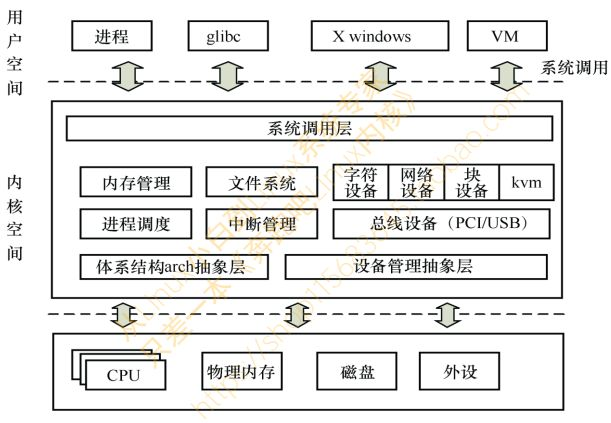

1. 单内核模式/宏内核
2. 层次式的微内核模式

# Linux内核
Linux 0.11 内核，则是采用了**单内核模式/宏内核**
- Linux在当时是业余作品
- Linus本人更喜欢宏内核的设计
- **宏内核架构的优点是设计简洁和性能比较好**
- **微内核架构最大的问题就是高度模块化带来的交互的冗余和效率的损耗** 
  
**Linux内核融合了宏内核和微内核的优点**。
- 模块化设计
- 抢占式内核
- 动态加载内核模块 
  
Linux内核的开发模式完全由社区来主导。
- Linus是Linux内核的最大的维护者和导演
- 每个子模块都有各自维护者 
  
Linux内核架构概貌 

