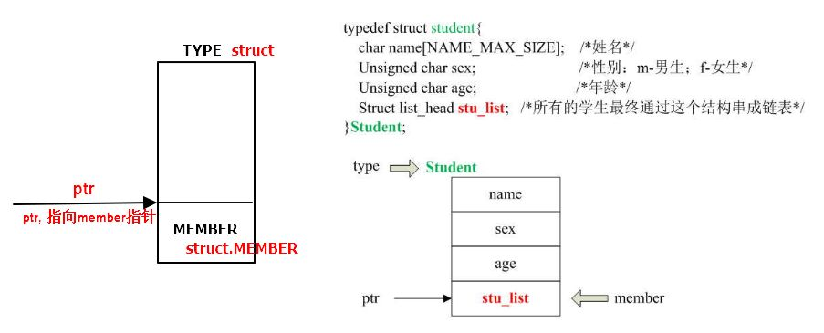
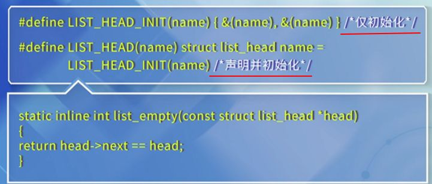
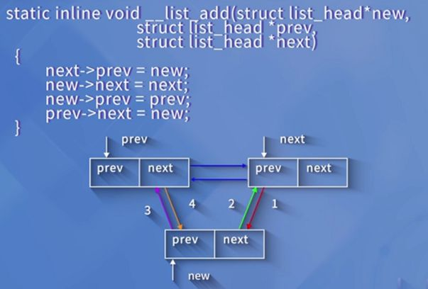
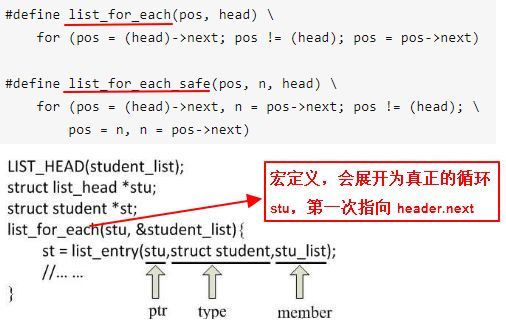

# ABI
- ABI(application binary interface)：二进制应用程序接口
- EABI，嵌入式ABI

# cpu的3种工作模式
- 实模式
- 保护模式
- 虚拟8086模式/虚拟实模式

# 内核
## 内存函数
	kmalloc
	kzalloc = kmalloc + 清0
	device = kmalloc(sizeof(struct mydemo_device), GFP_KERNEL);
## 内核双链表



```
#define offsetof(TYPE, MEMBER) ((size_t) &((TYPE *)0)->MEMBER)
计算MEMBER在TYPE中的距离

#define container_of(ptr, type, member) ({          \
    const typeof( ((type *)0)->member ) *__mptr = (ptr);    \
    (type *)( (char *)__mptr - offsetof(type,member) );})
结构体(type)
域成员变量(member)
type->member的指针(ptr)
获取整个结构体变量的指针。成员指针地址-减去成员指针距离

测试offsetof
struct student
{
    char gender;
    char name[20];
};
int gender_offset = offsetof(struct student, gender);
printf("gender_offset = %d\n", gender_offset);

链表节点定义
struct list_head {
    struct list_head *next, *prev;
};
```

```
删除节点
static inline void __list_del(struct list_head * prev, struct list_head * next)
{
    next->prev = prev;
    prev->next = next;
}

static inline void list_del(struct list_head *entry)
{
    __list_del(entry->prev, entry->next);
}

替换节点
static inline void list_replace(struct list_head *old,
                struct list_head *new)
{
    new->next = old->next;
    new->next->prev = new;
    new->prev = old->prev;
    new->prev->next = new;
}

判断双链表是否为空
static inline int list_empty(const struct list_head *head)
{
    return head->next == head;
}
```
添加节点，添加在头部或者尾部，都是通过header来操作的



遍历链表 和 获取节点



