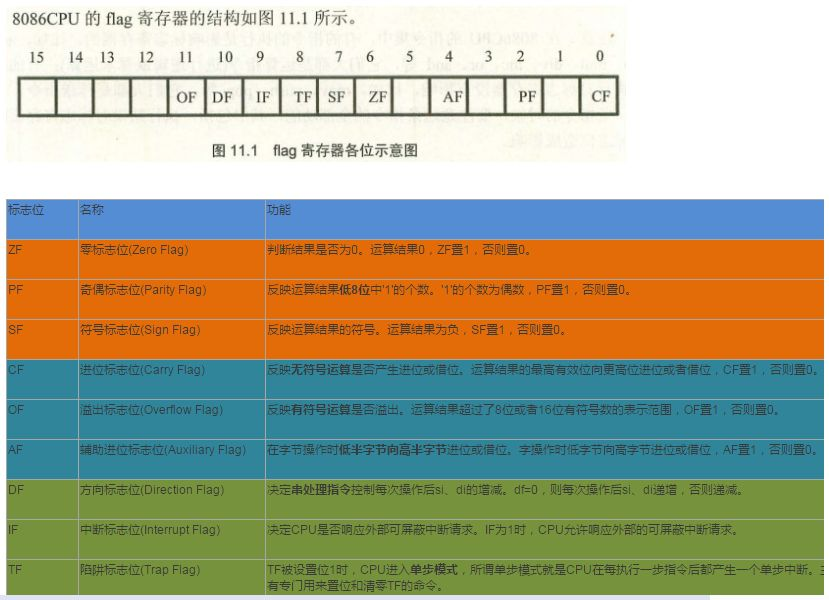

# 寄存器
## 数据寄存器/通用寄存器
    AH&AL＝AX：累加寄存器，常用于运算； 
    BH&BL＝BX：基址寄存器，常用于地址索引； 
    CH&CL＝CX：计数寄存器，常用于计数； 
    DH&DL＝DX：数据寄存器，常用于数据传递。 

## 地址寄存器/段地址寄存器 /选择器，在没有指定的情况下都是使用默认的那个
    CS（Code Segment）：代码段寄存器； 
    DS（Data Segment）：数据段寄存器； 
    SS（Stack Segment）：堆栈段寄存器； 
    ES（Extra Segment）：附加段寄存器。 

## 特殊功能的寄存器 
    IP（Instruction Pointer）：指令指针寄存器，与CS配合使用，执行程序； IP+=指令长度
    SP（Stack Pointer）：堆栈。栈顶位置，push时sp会不断减小。SP -= 数据长度 栈长度=SP-SS
    BP（Base Pointer）：堆栈。基址指针寄存器，可用作SS的一个相对基址位置（一般用于子程序）
    SI（Source Index）：串操作。源变址寄存器可用来存放相对于DS段之源变址指针； 
    DI（Destination Index）：串操作。目的变址寄存器，可用来存放相对于 ES 段之目的变址指针。
    FLAGS：标志寄存器
    FS和GS:80386新增. FS主要用来指向Thread Information Block(TIB).

## 标志寄存器

## 控制寄存器(CR0,CR1,CR2,CR3,CR4)
控制寄存器（CR0～CR3）用于控制和确定处理器的操作模式以及当前执行任务的特性

- ==CR0==，控制处理器操作模式和状态的系统控制标志
	- 0位，**保护模式允许位 PE(Protedted Enable)**
		- PE=1，则保护模式启动；
		- PE=0，则在实模式下运行
	- 31位，**分页允许位 PG(Paging Enable)**，和PE位 配合使用
		- 实模式，PG=0&&PE=0
		- 保护模式，开启分页。PG=1&&PE=1
		- 保护模式，没开启分页（段模式）。PG=0&&PE=1
	- 1位是监控协处理位MP(Moniter coprocessor)，它与第3位一起决定：当TS=1时操作码WAIT是否产生一个“协处理器不能使用”的出错信号。
	- 2位是模拟协处理器位 EM(Emulate coprocessor)，如果EM=1，则不能使用协处理器，如果EM=0，则允许使用协处理器。
	- 3位是任务转换位(Task Switch)，当一个任务转换完成之后，自动将它置1。随着TS=1，就不能使用协处理器。
	- 4位是微处理器的扩展类型位ET(Processor Extension Type)，其内保存着处理器扩展类型的信息，如果ET=0，则标识系统使用的是287协处理器，如果 ET=1，则表示系统使用的是387浮点协处理器。
	- 16位是写保护未即WP位(486系列之后)，只要将这一位置0就可以禁用写保护，置1则可将其恢复。
- CR1，保留不用
- CR2，含有导致页错误的线性地址
- CR3，中含有页目录表物理内存基地址，因此该寄存器也被称为页目录基地址寄存器PDBR（Page-Directory Base address Register）。
- CR4，在Pentium系列（包括486的后期版本）处理器中才实现，它处理的事务包括诸如何时启用虚拟8086模式等