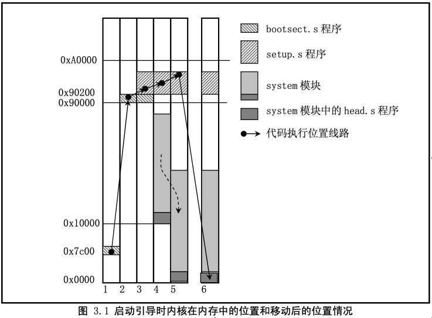

# 引导

## bootsect.s -- “搬运代码”
- 代码是磁盘引导块程序，驻留在磁盘的第一个扇区中
- 加电 ROM BIOS 自检后，引导扇区由 BIOS 加载到内存 0x7C00 处，然后将自己移动到内存 0x90000 处
- BIOS 中断 0x13，获取引导盘的参数（磁盘参数表），在屏幕上显示“Loading system...”
- 将 system 模块从磁盘上加载到内存 0x10000--0x90000
- system模块的长度不会超过0x80000字节（512kb），所以它并不会覆盖0x90000后面的bootset和setup模块

## setup.s -- “获取硬件配置参数“
- 利用ROM BIOS中断读取机器系统数据
- 并将这些数据保存到0x90000开始的位置(覆盖掉了 bootsect 程序所在的地方)
- 将system模块整块向下移动到内存绝对地址 0x00000 处
- 加载中断描述符寄存器和全局描述符寄存器
- 开启A20地址线，设置CPU进入保护模式
- 跳转到system模块的最前部分head.s程序继续运行

## head.s -- “正式进入linux前的工作”
- 加载数据段寄存器
- 设置中断描述符表idt，共256项，使各个表项均指向一个只报错误的哑中断程序
- 然后重新设置全局描述符表gdt，设定管理内存的分页处理机制
- 去运行main()程序

