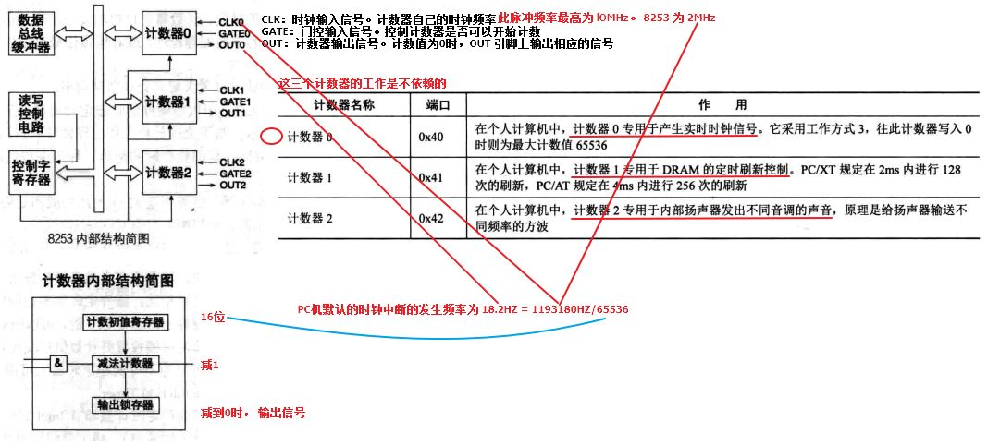

# 时钟分类
- 内部时钟，cpu内部
- 外部时钟/定时器，cpu与外部通信同步，中断
    - 不可编程定时器
    - 可编程定时器PIC，Programmable Interval Timer
        - Intel 8253/8254/82C54A ，后两个是 8253 的加强版和更强版

# 时钟周期
- **1个脉冲信号时间** 单位S
- 时钟发生器发出的脉冲信号做出周期变化的最短时间
- 时钟周期=1秒/晶振频率

# 时钟频率/晶振频率 单位HZ
- 1秒内 发送**脉冲信号的次数**

# 机器周期 单位S
- 完成一个基本操作所需要的时间（如单片机中“计数器”完成加1这个过程也是一个机器周期）
- 例如，取指令、存储器读、存储器写等，这每一项工作称为一个基本操作
- 1个机器周期 ≈ 12*时钟周期

# 计数器 
- 时钟中断的发生频率/信号输出次数 = 输入频率 / 计数器(16bit) 
- PC机默认的时钟中断的发生频率为 18.2HZ = 1193180HZ/65536
    - 有一个输入频率，在PC上是1193180HZ。
    - **在每一个时钟周期(CLK cycle)，计数器值会减1，当减到0时，就会触发一个输出。**

