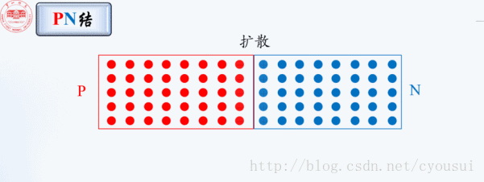
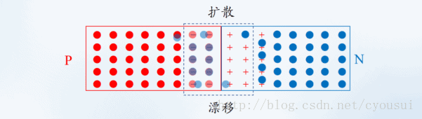
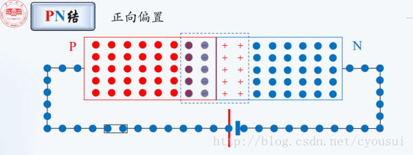
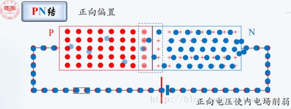
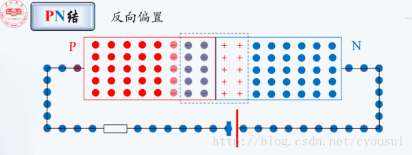
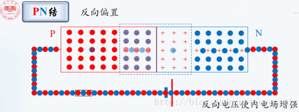

# 开关控制

# Vcc与GND 
Vcc-Volt Current Condenser
- 电源的正极，在电路中电位相对较高

GND-Ground
- 电源的负极，电位相对低
- 地线或0线，这个地并不是真正意义上的地

# 电平与边沿

# 二极管

## pn结

### 扩散、漂移

### 正向偏置（>0.7V）

### 反向偏置

## 总结

# 三极管（电流控制器件）
发射极，高浓度；容易产生大量电子（用两个正极或者负极的连接来保证）
基极，低浓度，窄；
集电极，平常浓度，宽；

发射极电流IE = 基极电流IB + 集电极电流IC
集电极电流IC  = 基极电流IB x 放大倍数

## 状态
用做开关：截止状态（关），饱和状态（开）
用做放大器：放大状态

### 截止状态

### 饱和状态

### 放大状态

### 击穿状态

# MOS管、场效应管（电压控制器件）
场效应晶体管（Field Effect Transistor缩写（FET））简称场效应管
- 结型场效应管，junction FET—JFET
	- N沟道和P沟道
- MOS管
	- 也称，金属氧化物半导体场效应管（Metal Oxide Semiconductor FET，简写为MOSFET）
	- 也称，绝缘栅型场效应管（IGFET，Insulated Gate Field Effect Transister）

与三极管对比
- 三极管（**电流**控制器件），外部信号源**提供电流给基极**，控制集电极或发射极的电流。
- 场效应管（**电压**控制器件），通过**输入电压**大小控制输出电流。

与三极管对应（方便理解）
- 场效应管： 栅极（gate）、漏极（drain）、         源极（source）
- 三极管：    基极（base）、集电极（collector）、发射极（emitter）
- N沟道场效应管 - NPN三极管
- P沟道场效应管  - PNP三极管

# RIP
被动红外线探测器（Passive infrared detectors）

# 继电器
- 继电器（英文名称：relay）是一种电控制器件
- 自动开关，通过小电流控制开关状态

- 上图是**两套**继电器
- 平时，4/6 和 13/11为闭合状态
- 1/16线圈通电，4/8 和 13/9为闭合状态

## 自保持电路

- 点按开关，线圈通电，绿色细线标识的通路
- 继电器中的，上下两排都是通路
- 松开开关后，蓝色细线表示的电路已经是通路，线圈依然通电
- 电路一直保持闭合

# led数码管/7段显示

# 模拟信号

